# StoryWeave Project Documentation

> **StoryWeave** is an iOS fantasy RPG and social storytelling application built with SwiftUI, Firebase, Cloudinary, and Gemini narration support. This README is structured as the main documentation source for the project report.

---

## 1. Project Summary

**StoryWeave** combines three major ideas inside one mobile application: an interactive D&D-inspired story game, a social community platform, and a creative story-building tool. Users can authenticate, create characters and skills, write custom stories, publish posts, react to community content, chat with connected users, play story campaigns, join multiplayer sessions, and track gameplay progress through custom analytics.

The app is built using **SwiftUI** and follows the **MVVM architecture**. Firebase Authentication manages user sessions, Cloud Firestore stores app data and real-time updates, Cloudinary handles image uploads, and Gemini is used for AI-assisted narration during gameplay. The application is designed as a feature-rich mobile computing project that demonstrates authentication, CRUD operations, real-time database listeners, API communication, state management, and modular iOS development.

---

## 2. Contributors Information

| Contributor | Roll | Main Contribution Area | Key Work Summary |
|---|---:|---|---|
| `Md. Shifat Hasan` | `2107067` |
| `Siam Basher` | `2107078` |
| `Afifa Sultana` | `2107087` | 

---

## 3. At-a-Glance Project Highlights

| Area | What StoryWeave Provides |
|---|---|
| **Account System** | Email/password signup, login, password reset, logout, and session-based routing. |
| **Social Layer** | User posts, image posts, likes, emoji reactions, comments, replies, and real-time feed updates. |
| **Creative Tools** | Character creator, skill creator, and custom story builder with scene linking. |
| **Gameplay** | D&D-style campaign, party selection, exploration, dialogue, combat, skill checks, XP, inventory, and autosave. |
| **AI Support** | Gemini-based narration with fallback text when API access is unavailable. |
| **Chat and Multiplayer** | User discovery, connection requests, conversations, invitations, and multiplayer session synchronization. |
| **Analytics** | Custom gameplay analytics stored in user profiles and displayed through profile statistics and achievements. |

---

## 4. Scope and Implemented Features

### 4.1 Authentication

StoryWeave begins with a secure account flow. Users can sign up with email and password, sign in to an existing account, reset a forgotten password, and log out from the profile screen. The application listens to the Firebase authentication state, so the root interface changes automatically between the authentication screens and the main tab-based app.

**Implemented behavior:**

- Email/password sign in.
- Email/password sign up.
- Password reset email.
- Logout.
- Authentication-state listener.
- Session-based routing between `AuthView` and `MainTabView`.

---

### 4.2 Home Feed

The Home Feed works as the social center of the app. Users can see community posts in real time, interact with posts, open post details, and move into comment or reaction flows. Post cards display the author, time, post body, optional image, like count, and entry point for discussion.

**Implemented behavior:**

- Real-time feed of user posts.
- Post cards with author, time, body, optional image, like count, and comment entry point.
- Real-time Firestore post loading.
- Like and unlike support.
- Optimistic UI update for fast like/unlike feedback.

---

### 4.3 Post Creation

Post creation allows users to share story moments, gameplay thoughts, or community updates. A post requires written content, while images, character attachments, and skill attachments are optional. If an image is selected, it is uploaded to Cloudinary and the returned URL is saved with the post data in Firestore.

**Implemented behavior:**

- New post creation from the post creation screen.
- Mandatory post body validation.
- Optional image selection using PhotosUI.
- Optional Cloudinary image upload.
- Optional character attachment.
- Optional skill attachment.
- Firestore post creation in `posts/{postId}`.
- Post update and delete support for user-managed post content.

---

### 4.4 Reactions, Comments, and Replies

The post detail page provides richer interaction than a simple feed card. Users can react with emojis, comment on posts, and reply to existing comments. Reactions are stored per user, which prevents duplicate emoji reactions from the same user on the same post. Comments and replies update in real time.

**Implemented behavior:**

- Emoji reactions on post detail page.
- One reaction per user per post using `posts/{postId}/reactions/{uid}`.
- Reaction update by choosing another emoji.
- Reaction removal by tapping the same emoji again.
- Real-time reaction listener.
- Comment creation.
- Comment update and delete support.
- Reply support using `parentCommentID`.
- Real-time comment listener.

---

### 4.5 Character Library and Character Creation

The character module lets users create RPG-style playable characters and browse existing characters from Firestore. Character statistics are controlled with bounded values, which prevents invalid combat data from being stored.

**Implemented behavior:**

- Character browsing from Firestore.
- Character creation with name, archetype, HP, attack, defense, dexterity, intelligence, and lore description.
- Character stat range control using `@Clamped`.
- Character persistence in `characters/{characterId}`.
- Character update support.
- Character delete support.

---

### 4.6 Skill Library and Skill Creation

Skills define special abilities that can be attached to gameplay or community posts. The skill module stores ability name, effect description, affected stat, target type, cooldown, and modifier value.

**Implemented behavior:**

- Skill browsing from Firestore.
- Skill creation with name, description, affected stat, modifier, cooldown, and target type.
- Skill stat range control using `@Clamped`.
- Skill persistence in `skills/{skillId}`.
- Skill update support.
- Skill delete support.

---

### 4.7 Story Builder and Community Stories

The story builder is one of the creative cores of StoryWeave. Users can create multi-scene stories, choose scene types, link decisions to future scenes, validate story structure, and publish the story for the community. Published stories can be played by other users, and the app tracks play count.

**Implemented behavior:**

- Custom story creation using `CreateStoryView`.
- Local scene add, edit, and delete before saving.
- Scene types: exploration, dialogue, combat, and skill check.
- Scene choices and next-scene linking.
- Story validation before save/publish.
- Published stories displayed in Community Stories.
- Story update support.
- Story play count increment.
- Owner story deletion.

---

### 4.8 Game Play

The gameplay module turns the app into an interactive story adventure. A player chooses a hero, optionally selects bot companions, and progresses through scenes. The game supports exploration, dialogue, combat, and skill-check scenes. Combat and skill checks use D20-style logic, while the game state tracks decisions, party survival, inventory, XP, and progress.

**Implemented behavior:**

- Campaign game start with player character and optional bot companions.
- Scene-based story progression.
- Exploration, dialogue, combat, and skill check scenes.
- Decision history tracking.
- D20 roll-based combat and skill check logic.
- Party survival tracking.
- XP and level progression.
- Autosave for default campaign games.
- Saved game update support.
- Game over and game complete states.

---

### 4.9 Gemini Narration

Gemini narration gives the game a more dynamic storytelling feel. The app creates a prompt from the current scene, party state, act context, and previous choices. Gemini returns streamed narration when available. If API access fails, the app still works by using fallback narration.

**Implemented behavior:**

- Prompt generation using current scene, act context, party state, and previous choices.
- Gemini API streaming narration using `GeminiService`.
- Fallback narration if API key is missing or if narration fails.

---

### 4.10 Chat and Connections

The chat system supports social interaction beyond posts. Users can discover others, send connection requests, accept or decline requests, open conversations, exchange messages, and track unread messages.

**Implemented behavior:**

- User discovery.
- Connection request sending.
- Accept/decline connection requests.
- Accepted connections list.
- Conversation creation between connected users.
- Real-time message stream.
- Conversation metadata update after new messages.
- Unread message count.
- Mark conversation as read.

---

### 4.11 Multiplayer Sessions

The multiplayer system allows users to create and manage shared game sessions. A host can create a session, invite users through chat, wait for players to select characters and mark themselves ready, then start the session. Session state is synchronized through Firestore.

**Implemented behavior:**

- Multiplayer session creation.
- Session joining.
- Player invitation through chat message.
- Player ready status with selected character.
- Host-controlled session start.
- Real-time session listening.
- Turn/action submission using `pendingActionJSON`.
- Session update during gameplay.
- Session abandonment.

---

### 4.12 Profile, Inventory, and Achievements

The profile screen gives users a personal dashboard. It displays profile information, custom gameplay statistics, inventory, achievements, and account actions. Profile name and avatar can be updated, and achievements are calculated from the user’s gameplay analytics.

**Implemented behavior:**

- Profile data loading.
- Display name update.
- Profile avatar upload through Cloudinary.
- Inventory loading from saved game or default inventory.
- Achievement calculation from custom gameplay analytics.
- Sign out from profile.

---

### 4.13 Analytics

Analytics in StoryWeave are custom gameplay analytics, not generic page-view analytics. The app records meaningful RPG progress such as combat wins, combat losses, character losses, skill-check attempts, skill-check passes, and act completion. These values are stored inside the user profile and used to display profile statistics and unlock achievements.

**Implemented behavior:**

- Custom gameplay analytics stored inside `users/{uid}.gameStats`.
- Combat win tracking.
- Combat loss tracking.
- Character loss tracking.
- Skill check attempted/passed tracking.
- Act completion tracking.
- Profile statistics display.
- Runtime achievement unlocking based on analytics.

---

## 5. Technology Stack

| Category | Technology / Tool |
|---|---|
| Language | Swift |
| UI Framework | SwiftUI |
| Architecture | MVVM |
| Authentication | Firebase Authentication |
| Database | Cloud Firestore |
| Real-Time Data | Firestore Snapshot Listeners |
| Image Upload | Cloudinary API |
| AI Narration | Gemini API |
| Image Selection | PhotosUI |
| Networking | URLSession |
| Data Mapping | Codable and JSON structures |
| State Management | `@State`, `@StateObject`, `@ObservedObject`, `@EnvironmentObject`, `@Published`, `@Binding` |
| Async Handling | async/await, Task, Combine-style observable updates |
| Development Tool | Xcode |
| Testing Platform | iOS Simulator / iPhone device |

---

## 6. UI Design and Screenshots

The screenshots are placed before workflow explanations so that the reader can first understand the user interface and then follow how each feature works internally.

### 6.1 Splash and Authentication

| Figure | Screenshot |
|---|---|
| Figure-1: Splash Screen of StoryWeave |  |
| Figure-2: Sign In Screen |  |
| Figure-3: Sign Up Screen |  |

### 6.2 Profile, Inventory, and Account Management

| Figure | Screenshot |
|---|---|
| Figure-4: Profile Top Section |  |
| Figure-5: Profile Statistics and Actions |  |
| Figure-6: Profile Display Picture View | 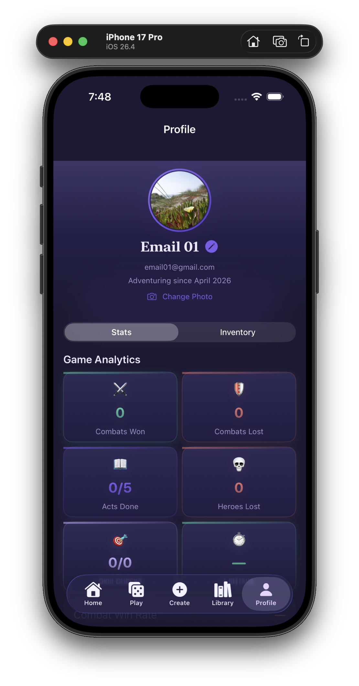 |
| Figure-7: Display Name Change | 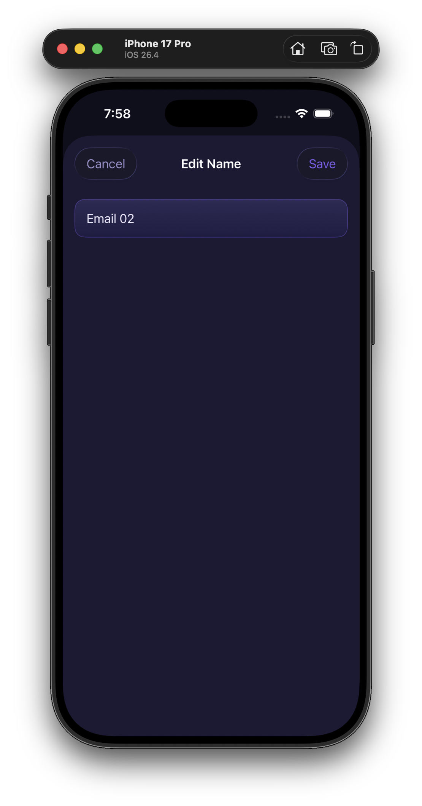 |
| Figure-8: Profile Picture Change | 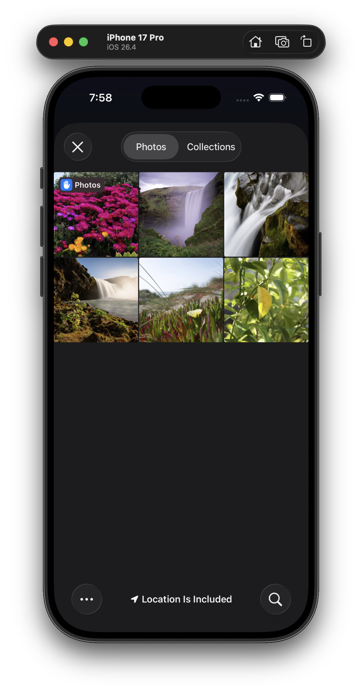 |
| Figure-9: Inventory Top Section |  |
| Figure-10: Inventory Bottom Section | 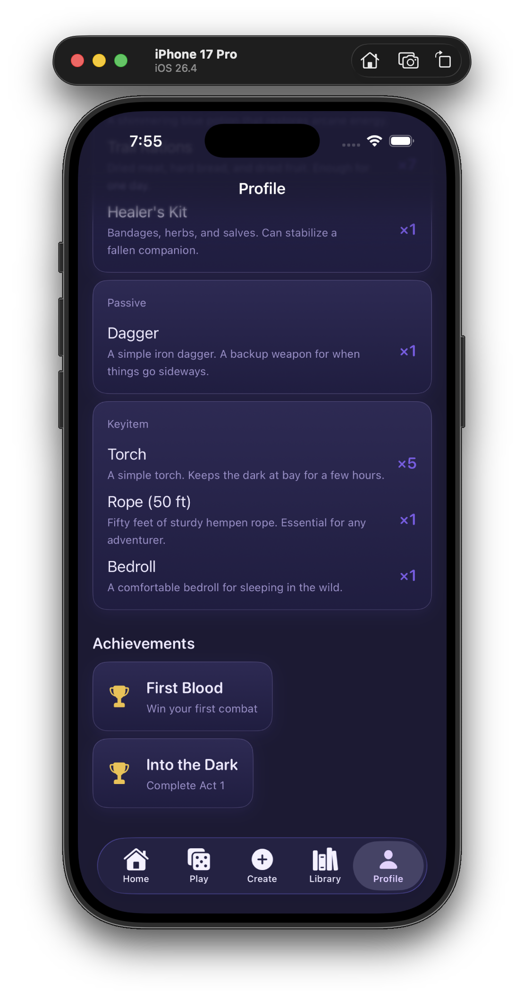 |

### 6.3 Library and Creation Screens

| Figure | Screenshot |
|---|---|
| Figure-11: Character Library |  |
| Figure-12: Skill Library |  |
| Figure-13: Creation Hub |  |
| Figure-14: Create New Post |  |
| Figure-15: Create New Character |  |
| Figure-16: Create New Skill |  |
| Figure-17: Create Story |  |

### 6.4 Feed, Post Details, Comments, and Editing

| Figure | Screenshot |
|---|---|
| Figure-18: Feed Posts |  |
| Figure-19: Post Details |  |
| Figure-20: Post Edit or Remove Options | 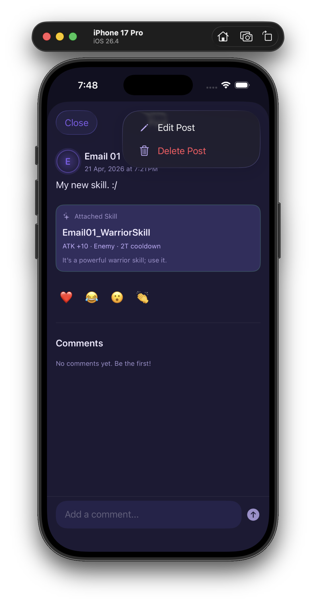 |
| Figure-21: Comments and Replies |  |
| Figure-22: Writing a New Comment | 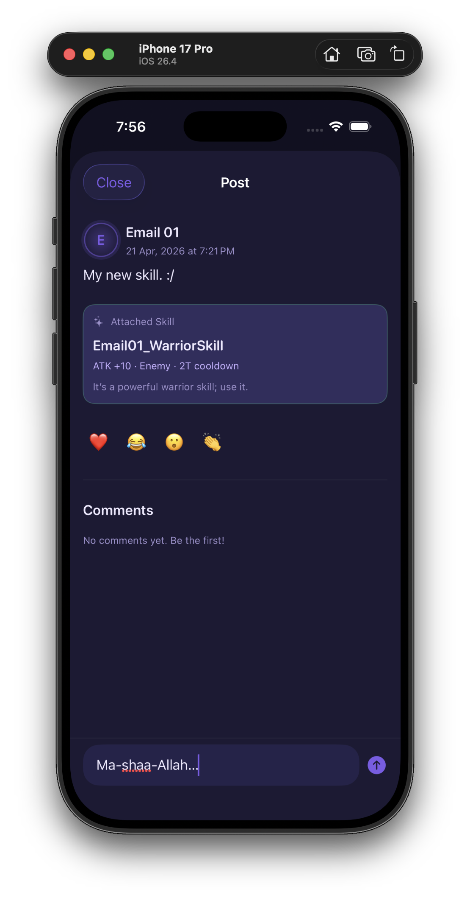 |
| Figure-23: Posted New Comment | 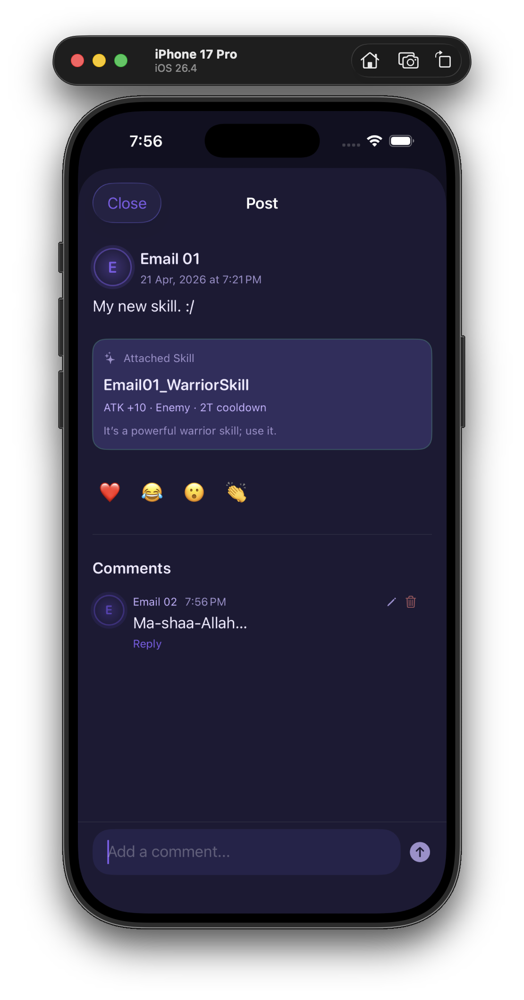 |

### 6.5 News and Chat

| Figure | Screenshot |
|---|---|
| Figure-24: News on Tech and Gaming |  |
| Figure-25: Message Request Approval and Decline |  |
| Figure-26: Inbox From User Perspective 1 | 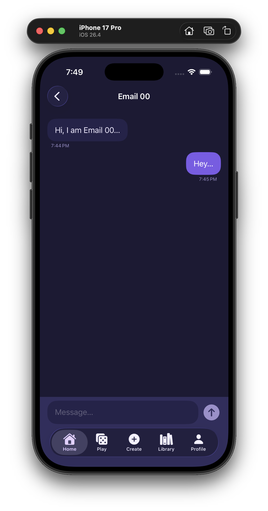 |
| Figure-27: Inbox From User Perspective 2 | 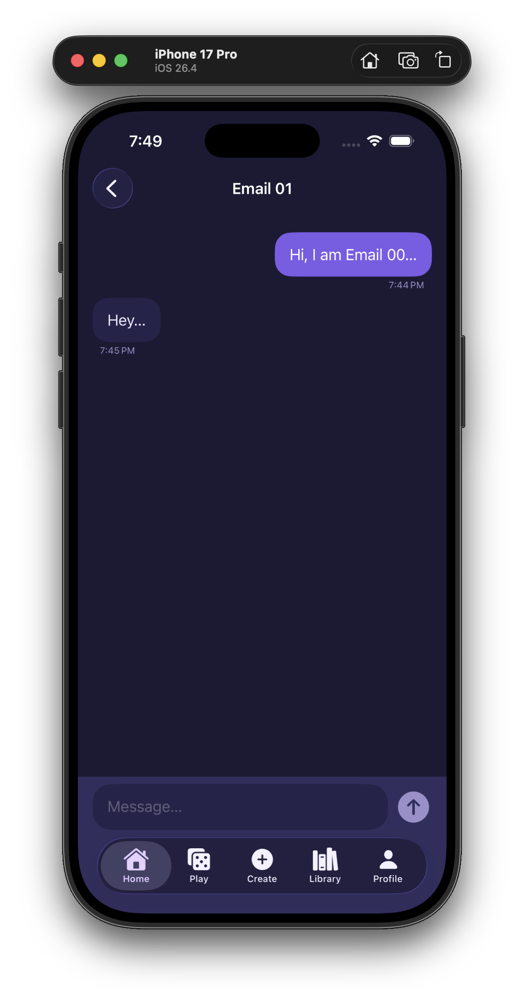 |
| Figure-28: Message Writing |  |
| Figure-29: Message Sent | 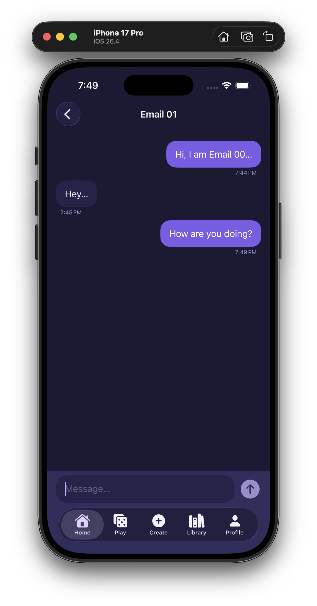 |
| Figure-30: Message Inbox List |  |

### 6.6 Play, Party Selection, Combat, and Dice Roll

| Figure | Screenshot |
|---|---|
| Figure-31: Community Play Section |  |
| Figure-32: Character List for Game Start | 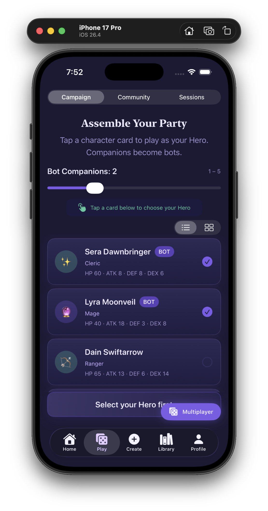 |
| Figure-33: Character Grid for Game Start |  |
| Figure-34: Select Your Hero |  |
| Figure-35: Play Ground Scene |  |
| Figure-36: Continued Play Ground Scene | 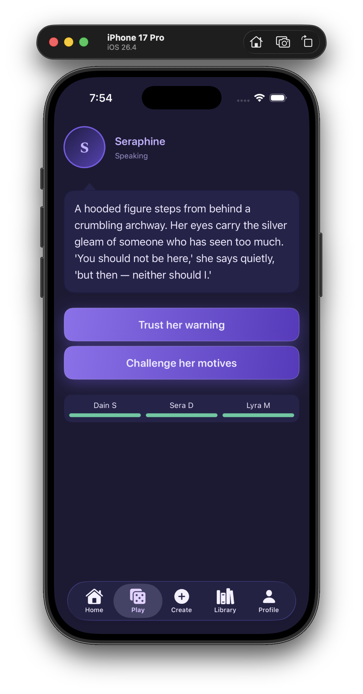 |
| Figure-37: Combat Scene |  |
| Figure-38: Enemy Bot in Combat |  |
| Figure-39: Friendly Bot in Combat | 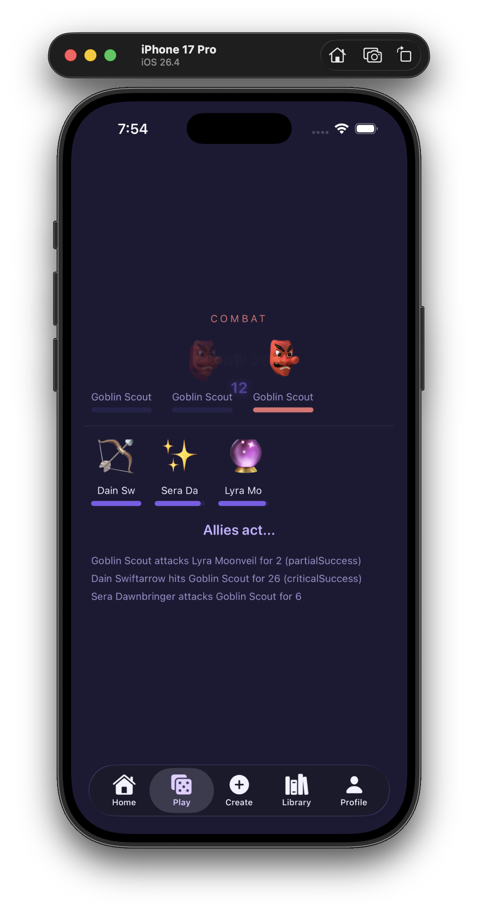 |
| Figure-40: Combat Continue State 1 |  |
| Figure-41: Combat Continue State 2 | 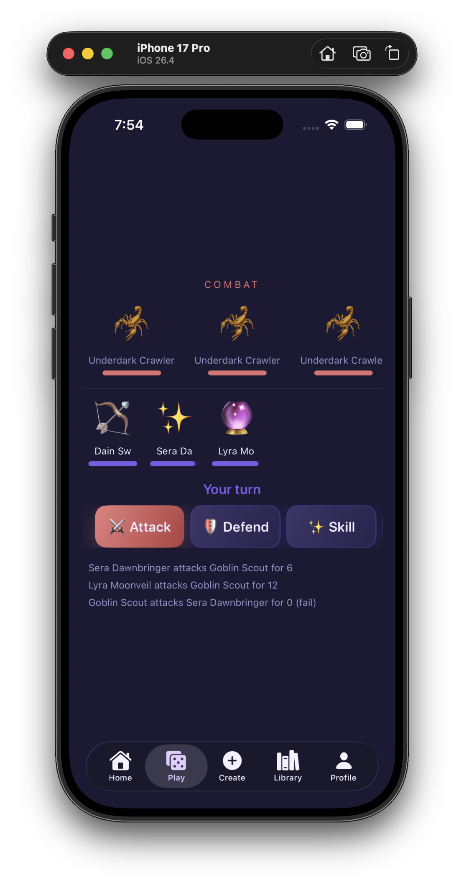 |
| Figure-42: Combat Continue State 3 | 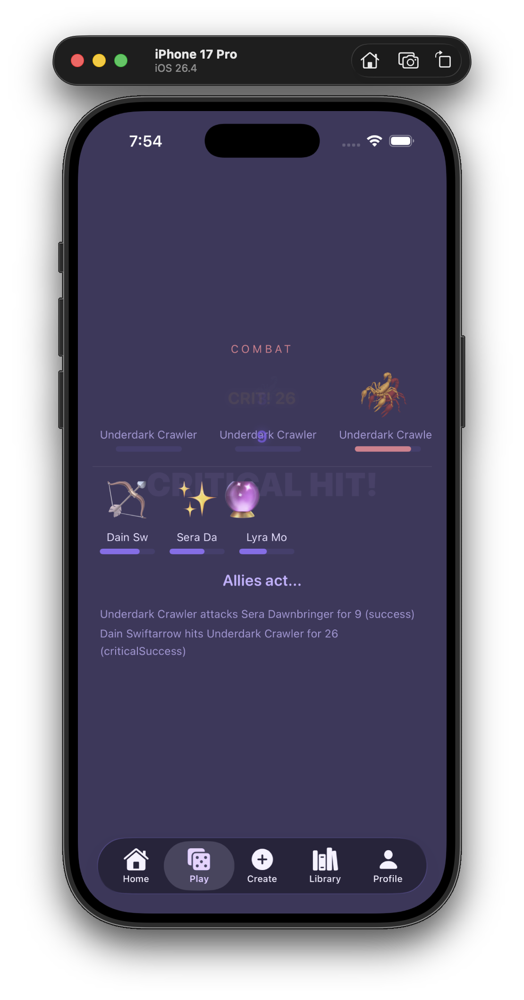 |
| Figure-43: D20 Dice Roll |  |
| Figure-44: D20 Dice Roll Animation |  |

---

## 7. Runtime Working of the App

StoryWeave starts from the app entry point and immediately prepares the backend environment. Firebase is configured at launch, and the authentication view model observes whether a valid user session exists.

**Runtime flow:**

1. The app launches and configures Firebase.
2. Authentication state is checked.
3. If no user is signed in, the app displays the authentication interface.
4. If a user is signed in, the app displays the main tab interface.
5. Default Firestore content is seeded when required.
6. The main app loads tabs for Home, Play, Chat, Library, and Profile.
7. Each tab uses its own ViewModel to load data and update UI state.
8. Firestore listeners keep posts, comments, reactions, chat, sessions, and community stories synchronized in real time.

**Main data cycle:**

```text
User Action → SwiftUI View → ViewModel → Service → Firebase/API → Published State → SwiftUI UI Update
```

---

## 8. Complete Workflows

### 8.1 Authentication Workflow

A guest user begins at the authentication screen. The user may sign up, sign in, or request a password reset. After successful authentication, Firebase updates the auth state and the application moves to the main tab interface.

**Workflow steps:**

1. User enters email and password.
2. Input is validated.
3. Firebase Authentication processes signup or login.
4. For signup, a profile document is created in Firestore.
5. Authentication state updates.
6. The app routes to `MainTabView`.
7. Logout clears the session and returns the user to the auth screen.

**Workflow figure placeholder:**


---

### 8.2 Home Feed and Post Interaction Workflow

The Home Feed listens to Firestore posts in real time. When a user creates, updates, deletes, likes, comments, or reacts to a post, the feed or detail screen reflects the latest state.

**Workflow steps:**

1. Home screen starts the post listener.
2. Firestore returns ordered post documents.
3. Post cards are rendered in the feed.
4. User can create a new post, open post details, like/unlike, react, comment, or reply.
5. Firestore updates the related document or subcollection.
6. Snapshot listeners refresh the UI automatically.

**Workflow figure placeholder:**


---

### 8.3 Character and Skill Workflow

Characters and skills are created through form-based screens, validated, and saved in Firestore. They can later be browsed, selected, attached to posts, or used in gameplay.

**Workflow steps:**

1. User opens character or skill creation screen.
2. User fills required form values.
3. Input range and required fields are validated.
4. Data is saved to Firestore.
5. Library screens read and display the saved data.
6. User can update or delete owned records when required.

**Workflow figure placeholder:**


---

### 8.4 Story Builder Workflow

The story builder lets users design playable story structures before publishing. A story can contain multiple scenes, choices, combat scenes, dialogue scenes, exploration scenes, and skill-check scenes.

**Workflow steps:**

1. User creates a new story.
2. User adds scenes and defines scene types.
3. User writes narration and choices.
4. Choices are linked to next scenes.
5. Story validation checks title, scenes, start scene, and scene links.
6. User saves or publishes the story.
7. Published stories appear in the community play section.
8. Owner can update or delete the story.

**Workflow figure placeholder:**


---

### 8.5 Gameplay Workflow

Gameplay begins with party selection and continues through story scenes. The game tracks decisions, character survival, inventory, XP, and analytics. Campaign games can be autosaved.

**Workflow steps:**

1. User opens Play tab.
2. User starts campaign or community story.
3. User selects hero and optional companions.
4. Scene is loaded.
5. Gemini narration is requested or fallback narration is shown.
6. User chooses actions or rolls dice.
7. Combat or skill-check result changes the game state.
8. Analytics and achievements update based on progress.
9. Campaign state is autosaved.
10. Game ends with success, failure, or continuation.

**Workflow figure placeholder:**


---

### 8.6 Chat and Multiplayer Workflow

The chat system starts with user discovery and connection requests. Once connected, users can exchange messages and send multiplayer session invitations.

**Workflow steps:**

1. User discovers another user.
2. User sends a connection request.
3. Receiver accepts or declines.
4. Accepted users can open a conversation.
5. Messages update in real time.
6. A host can create a multiplayer session.
7. Host invites connected users through chat.
8. Players join, select characters, and mark themselves ready.
9. Host starts the session.
10. Session state updates in real time.

**Workflow figure placeholder:**


---

## 9. Workflow Diagrams and Required Report Figures

The following figures should be added before final report submission:

| Diagram | Status |
|---|---|
| Authentication Workflow Diagram | Placeholder added |
| Main Navigation Workflow Diagram | Placeholder added |
| Feed/Post Workflow Diagram | Placeholder added |
| Character and Skill CRUD Workflow Diagram | Placeholder added |
| Story Builder Workflow Diagram | Placeholder added |
| Gameplay Workflow Diagram | Placeholder added |
| Chat Workflow Diagram | Placeholder added |
| Multiplayer Workflow Diagram | Placeholder added |
| Firebase Data Flow Diagram | Placeholder added |
| Use Case Diagram | Placeholder added |
| Activity Diagram | Placeholder added |
| MVVM Architecture Diagram | Placeholder added |
| Entity Relationship Diagram | Placeholder added |

---

## 10. Use Case Diagram Placeholder

**Actors:**

- Guest User
- Authenticated User
- Post Author
- Story Author
- Connected User
- Session Host
- Multiplayer Player

**Note:** There is no admin role in the current StoryWeave app.


---

## 11. Activity Diagram Placeholder

The activity diagram should show the complete app flow from launch to authentication, main tab routing, social interaction, story/game selection, single-player or multiplayer decisions, Firebase success/failure paths, and game completion states.


---

## 12. MVVM Architecture

StoryWeave follows MVVM to separate user interface, state logic, data models, and backend/API services.

| Layer | Responsibility | Main Examples |
|---|---|---|
| **Model** | Defines app data structures and Firestore/JSON data shape. | `UserProfile`, `Post`, `Comment`, `Reaction`, `Character`, `Skill`, `GameState`, `GameSession`, `Conversation`, `ChatMessage`, `Connection`, `UserStory` |
| **View** | Displays UI and receives user actions. | `AuthView`, `MainTabView`, `HomeView`, `GameView`, `ChatView`, `LibraryView`, `ProfileView`, `CreatePostView`, `CreateStoryView`, `MultiplayerLobbyView` |
| **ViewModel** | Handles screen state, validation, UI logic, and calls services. | `AuthViewModel`, `HomeViewModel`, `GameViewModel`, `ChatViewModel`, `ConversationViewModel`, `ProfileViewModel`, `CreatePostViewModel`, `CreateCharacterViewModel`, `CreateSkillViewModel`, `StoryBuilderViewModel`, `MultiplayerViewModel` |
| **Service** | Performs Firebase, API, storage, security, and utility work. | `AuthService`, `FirestoreService`, `CloudinaryService`, `GeminiService`, `SecretsManager`, `HapticEngine` |

**MVVM data flow:**

```text
View receives user input
      ↓
ViewModel validates and prepares data
      ↓
Service communicates with Firebase / Cloudinary / Gemini
      ↓
Model data is updated
      ↓
Published state changes
      ↓
SwiftUI redraws the interface
```

**MVVM diagram placeholder:**


---

## 13. Project Structure

```text
storyweave/
├── StoryWeaveApp.swift
├── Models/
├── Services/
├── ViewModels/
├── Views/
│   ├── Auth/
│   ├── Home/
│   ├── Game/
│   ├── Chat/
│   ├── Library/
│   ├── Plus/
│   ├── Profile/
│   └── Inventory/
├── Game/
├── DesignSystem/
├── PropertyWrappers/
└── Assets.xcassets/
```

| Folder | Purpose |
|---|---|
| `Models` | Data models for users, posts, comments, characters, skills, stories, game state, chat, and sessions. |
| `Services` | Firebase authentication, Firestore database operations, Cloudinary uploads, Gemini narration, secrets, and haptics. |
| `ViewModels` | State and business logic for views. |
| `Views` | SwiftUI screens and UI components. |
| `Game` | Story content, combat engine, scene management, narration prompt building, and game providers. |
| `DesignSystem` | Shared colors and reusable visual components. |
| `PropertyWrappers` | Custom validation and range-control wrappers. |
| `Assets.xcassets` | App icons, colors, and visual assets. |

---

## 14. Data Model and Entity Relationship Overview

StoryWeave has a connected data model where users create posts, comments, reactions, characters, skills, stories, conversations, and game sessions.

| Entity | Main Relationship |
|---|---|
| `UserProfile` | Owns profile data and nested gameplay analytics. |
| `Post` | Created by a user; may contain image, character attachment, or skill attachment. |
| `Comment` | Belongs to a post; can be a top-level comment or reply. |
| `Reaction` | Belongs to one post and one user. |
| `Character` | Created by a user and used in gameplay or post attachment. |
| `Skill` | Created by a user and used as an ability definition or post attachment. |
| `UserStory` | Created by a user; contains multiple scenes and choices. |
| `GameState` | Stores campaign progress for one user. |
| `Connection` | Represents relationship status between two users. |
| `Conversation` | Represents chat metadata between connected users. |
| `ChatMessage` | Belongs to a conversation. |
| `GameSession` | Represents multiplayer lobby/game state shared by players. |

**ER diagram placeholder:**


---

## 15. Firestore Collection Structure

### 15.1 `users/{uid}`

```json
{
  "id": "uid_123",
  "displayName": "Adventurer",
  "avatarURL": "https://res.cloudinary.com/.../avatar.png",
  "createdAt": "Timestamp",
  "gameStats": {
    "totalPlaytimeSeconds": 0,
    "actsCompleted": 2,
    "combatsWon": 4,
    "combatsLost": 1,
    "charactersLost": 0,
    "skillChecksAttempted": 8,
    "skillChecksPassed": 6
  }
}
```

**Used for:** profile creation, profile loading, display name update, avatar update, analytics update, achievement calculation.

---

### 15.2 `characters/{characterId}`

```json
{
  "id": "character_123",
  "name": "Aric Ironfist",
  "archetype": "warrior",
  "hp": 120,
  "maxHP": 120,
  "atk": 12,
  "def": 8,
  "dex": 7,
  "intel": 5,
  "skills": ["skill_001"],
  "createdByUID": "uid_123",
  "loreDescription": "A veteran fighter from the northern hills.",
  "level": 1,
  "xp": 0
}
```

**Used for:** character creation, browsing, updating, deleting, party selection, gameplay, and post attachment.

---

### 15.3 `skills/{skillId}`

```json
{
  "id": "skill_001",
  "name": "Flame Strike",
  "description": "A fire-based attack that damages an enemy.",
  "statAffected": "atk",
  "modifier": 5,
  "cooldownTurns": 2,
  "targetType": "enemy",
  "createdByUID": "uid_123"
}
```

**Used for:** skill creation, browsing, updating, deleting, combat ability definition, and post attachment.

---

### 15.4 `posts/{postId}`

```json
{
  "id": "post_123",
  "authorUID": "uid_123",
  "authorName": "Adventurer",
  "body": "Our party entered the cursed forest today.",
  "imageURL": "https://res.cloudinary.com/.../post.png",
  "attachedCharacterID": "character_123",
  "attachedSkillID": "skill_001",
  "timestamp": "Timestamp",
  "likeCount": 10
}
```

**Used for:** post creation, real-time feed loading, post editing, post deletion, image display, character/skill attachment, and like count updates.

---

### 15.5 `posts/{postId}/comments/{commentId}`

```json
{
  "id": "comment_001",
  "postID": "post_123",
  "parentCommentID": null,
  "authorUID": "uid_456",
  "authorName": "MageUser",
  "body": "This story setup is exciting!",
  "timestamp": "Timestamp"
}
```

**Reply example:**

```json
{
  "id": "comment_002",
  "postID": "post_123",
  "parentCommentID": "comment_001",
  "authorUID": "uid_123",
  "authorName": "Adventurer",
  "body": "Thank you! The next scene has combat.",
  "timestamp": "Timestamp"
}
```

**Used for:** comment creation, reply creation, comment updates, comment deletion, and real-time discussion loading.

---

### 15.6 `posts/{postId}/reactions/{uid}`

```json
{
  "id": "uid_456",
  "postID": "post_123",
  "uid": "uid_456",
  "displayName": "MageUser",
  "emoji": "👏",
  "timestamp": "Timestamp"
}
```

**Used for:** emoji reaction creation, reaction update, reaction removal, and real-time reaction display.

---

### 15.7 `postLikes/{postId}/likers/{uid}`

```json
{
  "uid": "uid_456"
}
```

**Used for:** tracking which users liked a post and preventing duplicate likes from the same user.

---

### 15.8 `gameSaves/{uid}`

```json
{
  "currentActIndex": 1,
  "currentSceneID": "scene_forest_gate",
  "partyCharacterIDs": ["character_123", "character_456"],
  "playerCharacterID": "character_123",
  "botCharacterIDs": ["character_456"],
  "decisionHistory": {
    "scene_intro": "Enter the forest"
  },
  "survivingCharacterIDs": ["character_123", "character_456"],
  "inventory": [
    {
      "id": "item_001",
      "name": "Healing Potion",
      "type": "consumable",
      "quantity": 2
    }
  ],
  "playerXP": 150,
  "playerLevel": 2,
  "customStartSceneID": null
}
```

**Used for:** campaign autosave, game loading, inventory loading, XP tracking, and progress restoration.

---

### 15.9 `connections/{pairId}`

```json
{
  "id": "uid_123_uid_456",
  "fromUID": "uid_123",
  "fromName": "Adventurer",
  "toUID": "uid_456",
  "toName": "MageUser",
  "status": "accepted",
  "participants": ["uid_123", "uid_456"],
  "createdAt": "Timestamp"
}
```

**Used for:** connection requests, accepted connections, declined requests, and chat permission structure.

---

### 15.10 `conversations/{pairId}`

```json
{
  "id": "uid_123_uid_456",
  "participantUIDs": ["uid_123", "uid_456"],
  "participantNames": {
    "uid_123": "Adventurer",
    "uid_456": "MageUser"
  },
  "lastMessageBody": "Ready for the session?",
  "lastMessageSenderUID": "uid_123",
  "lastMessageTimestamp": "Timestamp",
  "unreadCounts": {
    "uid_123": 0,
    "uid_456": 1
  }
}
```

**Used for:** conversation creation, inbox display, unread counts, and last-message preview.

---

### 15.11 `conversations/{pairId}/messages/{messageId}`

```json
{
  "id": "message_001",
  "conversationID": "uid_123_uid_456",
  "senderUID": "uid_123",
  "senderName": "Adventurer",
  "body": "Join my multiplayer session.",
  "timestamp": "Timestamp",
  "inviteSessionID": "session_001"
}
```

**Used for:** real-time messaging and multiplayer session invitations through chat.

---

### 15.12 `userStories/{storyId}`

```json
{
  "id": "story_001",
  "authorUID": "uid_123",
  "authorName": "Adventurer",
  "title": "The Ruins of Moonfall",
  "synopsis": "A party explores a cursed ruin under a broken moon.",
  "scenes": [
    {
      "id": "scene_001",
      "sceneType": "exploration",
      "narrationText": "You stand before the ruined gate.",
      "choices": ["Enter", "Search outside"],
      "nextSceneIDs": {
        "Enter": "scene_002",
        "Search outside": "scene_003"
      },
      "npcName": null,
      "enemies": null,
      "skillCheckStat": null,
      "skillCheckDC": null,
      "skillCheckSuccessSceneID": null,
      "skillCheckFailureSceneID": null
    }
  ],
  "startSceneID": "scene_001",
  "isPublished": true,
  "createdAt": "Timestamp",
  "playCount": 5
}
```

**Used for:** story creation, scene editing, publishing, community story listing, play-count tracking, story updating, and owner deletion.

---

### 15.13 `gameSessions/{sessionId}`

```json
{
  "id": "session_001",
  "hostUID": "uid_123",
  "storyType": "campaign",
  "storyID": null,
  "status": "playing",
  "invitedUIDs": ["uid_456"],
  "players": [
    {
      "uid": "uid_123",
      "displayName": "Adventurer",
      "characterID": "character_123",
      "isReady": true
    },
    {
      "uid": "uid_456",
      "displayName": "MageUser",
      "characterID": "character_456",
      "isReady": true
    }
  ],
  "botCharacterIDs": [],
  "gameState": {
    "currentSceneID": "scene_forest_gate",
    "playerXP": 150,
    "playerLevel": 2
  },
  "currentNarration": "The forest darkens as the party moves forward.",
  "currentTurnUID": "uid_123",
  "currentTurnIndex": 0,
  "combatSnapshot": null,
  "pendingActionJSON": null,
  "createdAt": "Timestamp"
}
```

**Used for:** multiplayer lobby creation, joining, ready state updates, host start, real-time gameplay sync, action submission, narration updates, and session abandonment.

---

### 15.14 `meta/seed_v1`

```json
{
  "seeded": true,
  "seededAt": "Timestamp"
}
```

**Used for:** tracking whether default Firestore content has already been seeded.

---

## 16. Cloudinary and Gemini Data Structures

### 16.1 Cloudinary Upload Response

```json
{
  "secure_url": "https://res.cloudinary.com/demo/image/upload/v123/storyweave/post.png",
  "public_id": "storyweave/post_123",
  "format": "png",
  "resource_type": "image"
}
```

**Used for:** storing uploaded image URLs in Firestore instead of storing image binary data inside Firestore documents.

### 16.2 Gemini Narration Request Structure

```json
{
  "contents": [
    {
      "parts": [
        {
          "text": "Narrate the current RPG scene using the party, act context, and previous choices."
        }
      ]
    }
  ]
}
```

### 16.3 Gemini Stream Response Structure

```json
{
  "candidates": [
    {
      "content": {
        "parts": [
          {
            "text": "The torches flicker as the heroes enter the ancient hall..."
          }
        ]
      }
    }
  ]
}
```

**Security note:** Real API keys and secrets should never be written inside the README or report.

---

## 17. CRUD Operations Summary

StoryWeave uses Firestore CRUD operations across almost every major feature. The CRUD design is modular: views collect user input, view models validate and prepare data, and services persist the data.

| Module | Create | Read | Update | Delete |
|---|---|---|---|---|
| User Profile | New profile after signup | Load profile by user ID | Update display name, avatar, analytics | Account-level deletion not documented in report scope |
| Character | Create character | Browse/fetch characters | Update character data | Delete character |
| Skill | Create skill | Browse/fetch skills | Update skill data | Delete skill |
| Post | Create post | Real-time feed and post detail | Edit post and update like count | Delete post |
| Comment/Reply | Add comment or reply | Real-time comment stream | Edit comment/reply | Delete comment/reply |
| Reaction | Add emoji reaction | Real-time reaction stream | Change emoji reaction | Remove reaction |
| Like | Add liker record and increment count | Check liked state | Increment/decrement count | Remove liker record |
| Story | Create story and scenes | Load own/published stories | Edit story and publish status | Delete owned story |
| Game Save | Create save after gameplay | Load saved campaign | Update autosave progress | Reset/remove save when needed |
| Connection | Send request | Load incoming/outgoing/accepted connections | Accept/decline request | Remove/clear connection when needed |
| Conversation | Create conversation | Load inbox | Update last message/unread counts | Conversation deletion not part of report scope |
| Message | Send message | Real-time message stream | Read-state affects conversation metadata | Message deletion not part of report scope |
| Game Session | Create multiplayer session | Listen to session updates | Update players, ready state, turn, narration, and game state | Abandon/remove session flow |

---

## 18. Real-Time Listener Usage

Real-time updates are one of the strongest technical parts of the project. Instead of requiring users to refresh manually, Firestore listeners keep the UI synchronized.

| Real-Time Area | What Updates Automatically |
|---|---|
| Home Feed | New, edited, or deleted posts appear in feed. |
| Comments | New comments and replies appear inside post details. |
| Reactions | Emoji reactions update for all users viewing the post. |
| Connections | Incoming and accepted connection status updates. |
| Conversations | Inbox metadata and unread counts update. |
| Messages | Chat messages appear in real time. |
| Community Stories | Published stories update in the play section. |
| Multiplayer Sessions | Lobby, ready state, turn state, narration, and gameplay status update across players. |

---

## 19. Custom Gameplay Analytics

Analytics in StoryWeave are stored as a nested object inside the user profile. These analytics are meaningful because they are tied directly to gameplay results, not just screen visits.

### 19.1 Analytics Fields

```json
{
  "gameStats": {
    "totalPlaytimeSeconds": 0,
    "actsCompleted": 2,
    "combatsWon": 4,
    "combatsLost": 1,
    "charactersLost": 0,
    "skillChecksAttempted": 8,
    "skillChecksPassed": 6
  }
}
```

### 19.2 What Each Field Means

| Field | Meaning |
|---|---|
| `totalPlaytimeSeconds` | Total tracked playtime value stored for the user. |
| `actsCompleted` | Number of story acts completed by the player. |
| `combatsWon` | Number of combat encounters won. |
| `combatsLost` | Number of combat encounters lost. |
| `charactersLost` | Number of party characters lost during gameplay. |
| `skillChecksAttempted` | Number of skill checks attempted. |
| `skillChecksPassed` | Number of successful skill checks. |

### 19.3 How Analytics Are Used

- Profile statistics show gameplay progress.
- Combat win rate can be calculated from combat wins and losses.
- Skill-check accuracy can be calculated from attempted and passed skill checks.
- Achievements unlock based on analytics milestones.
- Analytics values make the profile page feel like a gameplay dashboard.

### 19.4 Achievement Examples

| Achievement | Unlock Condition |
|---|---|
| First Blood | Win at least one combat. |
| Into the Dark | Complete at least one act. |
| Echoes of the Fallen | Complete the full act progression. |
| Unbroken | Complete major progress without losing characters. |
| Skill Master | Attempt multiple skill checks. |
| Tactician | Win multiple combat encounters. |

---

## 20. Firebase Authentication

Firebase Authentication is responsible for account identity. Firestore is responsible for storing the profile and user-related app data.

| Auth Feature | Description |
|---|---|
| Signup | Creates an authentication account and a matching Firestore profile. |
| Login | Authenticates existing email/password users. |
| Password Reset | Sends reset email through Firebase. |
| Logout | Ends the current session. |
| Auth-State Listener | Automatically updates app routing when session state changes. |
| Session Routing | Shows authentication screens for guests and main app screens for signed-in users. |

---

## 21. State Management and Data Flow

SwiftUI state management keeps the app reactive. When backend data changes, published values update and the UI redraws.

| State Tool | Project Use |
|---|---|
| `@State` | Local screen values such as text fields, selected tabs, form values, and temporary UI state. |
| `@Binding` | Passes editable values between parent and child views. |
| `@StateObject` | Creates and owns ViewModel instances for screens. |
| `@ObservedObject` | Observes ViewModels passed from parent views. |
| `@EnvironmentObject` | Shares app-wide dependencies such as authentication state. |
| `@Published` | Publishes ViewModel data changes to SwiftUI views. |
| async/await | Handles Firebase, Cloudinary, Gemini, and gameplay operations asynchronously. |
| Task | Starts asynchronous work from SwiftUI actions. |

**Data flow:**

```text
Tap / Type / Select
      ↓
SwiftUI View
      ↓
ViewModel validation and state update
      ↓
Firestore / Cloudinary / Gemini operation
      ↓
Model data changes
      ↓
Published property updates
      ↓
SwiftUI redraws the screen
```

---

## 22. User Roles and Permissions

| Role | Permission / Behavior |
|---|---|
| Guest User | Can access authentication screens only. |
| Authenticated User | Can access main app, feed, gameplay, chat, library, and profile. |
| Post Author | Can manage owned posts and interact with community content. |
| Story Author | Can create, update, publish, and delete owned stories. |
| Connected User | Can chat with accepted connections. |
| Session Host | Can create sessions, invite users, and start multiplayer sessions. |
| Multiplayer Player | Can join sessions, select character, mark ready, and submit actions. |

**Admin role:** Not implemented in this project.

---

## 23. Validation and Error Handling

| Area | Validation / Error Handling |
|---|---|
| Authentication | Email, password, and display name validation. |
| Post Creation | Empty post body is blocked. |
| Character Creation | Required name and bounded stat values. |
| Skill Creation | Required name and bounded modifier/cooldown values. |
| Story Builder | Title, scene count, start scene, and scene-link validation. |
| Image Upload | Cloudinary upload failure is handled before saving image URL. |
| Firebase | Loading and error messages are shown when backend operations fail. |
| Gemini | Fallback narration is used when API key is missing or narration fails. |
| Chat | Empty message and missing conversation states are handled. |
| Multiplayer | Session state, ready state, and action state are checked before game start or action resolution. |

---

## 24. Security and Privacy

| Security Area | Implementation / Note |
|---|---|
| Authentication | Firebase Authentication protects account access. |
| User Data | User-specific records use Firebase UID as owner or document reference. |
| Password Reset | Password reset is handled through Firebase email reset. |
| Image Upload | Images are uploaded to Cloudinary; Firestore stores URLs only. |
| API Secrets | Secret values should be stored in `Secrets.plist` and must not be exposed publicly. |
| Firestore Rules | Production deployment should include strict Firestore security rules. |
| Privacy-Sensitive Media | Photo selection is handled through iOS PhotosUI. |

---

## 25. Testing and Result Analysis

| Test Area | Test Case | Expected Result |
|---|---|---|
| Authentication | Sign up with valid email and password | User account and profile are created. |
| Authentication | Sign in with valid credentials | User enters main app. |
| Authentication | Request password reset | Reset email is sent. |
| Post | Create post with text only | Post appears in real-time feed. |
| Post | Create post with image | Image uploads and post displays image URL content. |
| Post | Edit or delete owned post | Feed reflects updated/removed post. |
| Like | Like and unlike a post | Like count changes correctly. |
| Reaction | Add, change, and remove emoji reaction | Reaction state updates in real time. |
| Comment | Add comment and reply | Discussion appears under post detail. |
| Character | Create/update/delete character | Character list reflects changes. |
| Skill | Create/update/delete skill | Skill list reflects changes. |
| Story | Create, update, publish, and delete story | Published story appears/disappears correctly. |
| Gameplay | Start campaign and make choices | Scene progresses correctly. |
| Gameplay | Combat and skill check | Result updates game state and analytics. |
| Game Save | Continue saved game | Previous progress loads correctly. |
| Chat | Send connection request and accept | Conversation becomes available. |
| Message | Send message | Message appears in real time. |
| Multiplayer | Create, invite, join, ready, and start | Session state updates across users. |
| Profile | Update name and avatar | Profile reflects changes. |
| Analytics | Win combat or pass skill check | Profile statistics update. |

---

## 26. Lab Concept Implementation Mapping

| Course Concept | StoryWeave Implementation |
|---|---|
| Swift Fundamentals | Models, enums, structs, optionals, arrays, dictionaries, and functions. |
| SwiftUI Layout | Authentication, feed, game, chat, library, creation, and profile screens. |
| Navigation | Main tab navigation, nested screen navigation, sheets, and detail pages. |
| State Management | Local state, observable ViewModels, published values, and environment state. |
| MVVM | Models, Views, ViewModels, and Services are separated. |
| Firebase Authentication | Signup, login, password reset, logout, and auth-state routing. |
| Firestore CRUD | Users, posts, comments, reactions, characters, skills, stories, chat, saves, and sessions. |
| Real-Time Database | Snapshot listeners for feed, comments, reactions, chat, stories, and sessions. |
| JSON/API Handling | Cloudinary response, Gemini request/response, and Codable-based data mapping. |
| Async Programming | Backend calls, API calls, image uploads, and game narration. |
| Property Wrappers | Validation and stat-range control using custom wrappers and SwiftUI wrappers. |

---

## 27. Challenges and Solutions

| Challenge | Solution |
|---|---|
| Managing a large number of features | Used MVVM and service layers to separate responsibilities. |
| Keeping the feed and chat updated | Used Firestore real-time listeners. |
| Handling images efficiently | Uploaded images to Cloudinary and stored only URLs in Firestore. |
| Preventing invalid character/skill stats | Used bounded values and validation. |
| Building complex story flows | Used scene IDs and next-scene linking. |
| Preserving gameplay progress | Used user-scoped game saves. |
| Synchronizing multiplayer state | Stored session state in Firestore and listened to real-time updates. |
| AI narration failure | Added fallback narration when Gemini is unavailable. |
| Displaying meaningful progress | Stored custom gameplay analytics in the user profile. |

---

## 32. References

- Apple SwiftUI Documentation: https://developer.apple.com/documentation/swiftui
- Apple PhotosUI Documentation: https://developer.apple.com/documentation/photosui
- Swift Codable Documentation: https://developer.apple.com/documentation/swift/codable
- Firebase Authentication Documentation: https://firebase.google.com/docs/auth
- Cloud Firestore Documentation: https://firebase.google.com/docs/firestore
- Firebase iOS Setup Documentation: https://firebase.google.com/docs/ios/setup
- Cloudinary Documentation: https://cloudinary.com/documentation
- Gemini API Documentation: https://ai.google.dev/gemini-api/docs

---
