# StoryWeave — A D&D RPG Adventure Platform

**Khulna University of Engineering & Technology**
Department of Computer Science and Engineering
Course No: CSE 3218
Course Title: Mobile Computing Laboratory
Date: 21/04/2026

---

**Topic: StoryWeave — SwiftUI D&D Adventure Platform with AI Narration & Social Layer**

**Submitted By**

| Name             | Roll    |
| ---------------- | ------- |
| Md. Shifat Hasan | 2107067 |
| Md. Siam Basher  | 2107078 |
| Afifa Sultana    | 2107087 |

**Conducted By:**

- Md. Repon Islam, Assistant Professor, Dept. of CSE, KUET
- Most. Kaniz Fatema Isha, Lecturer, Dept. of CSE, KUET

---

## Objectives

- To design and implement a fully featured, single-player party-based RPG iOS application inspired by Dungeons & Dragons.
- To integrate Google Gemini Flash 2.0 for AI-driven streamed narrative generation that responds dynamically to player decisions and surviving party state.
- To build a real-time social community layer — feed, direct messaging, emoji reactions, threaded comments, and a tech/gaming news tab — backed by Firebase Firestore.
- To implement a community story builder that allows users to author, publish, and share their own multi-scene branching adventures.
- To deliver all game visuals and animations (dice rolls, combat hit effects, level-up particle bursts, death overlay) entirely in SwiftUI with no external asset files.

---

## Introduction

StoryWeave is a dark-fantasy iOS application that merges a turn-based RPG game engine with a living social community platform. After signing in, the player assembles a party of up to five AI-controlled bot companions, picks an archetype hero, and embarks on a five-act campaign where every narrative beat is generated in real time by Google Gemini Flash 2.0 via Server-Sent Events. Four scene types drive the gameplay: open-world exploration with branching choices, character dialogue, turn-based combat with a full bot-AI decision engine, and D20 skill checks — each rendered with hand-crafted SwiftUI animations and haptic feedback.

Beyond solo play, StoryWeave provides a full social layer. Users post adventure highlights with optional image, character, or skill card attachments; react with emoji; and write threaded comments. A direct-message system built on Firestore real-time listeners lets connected players chat privately. A multi-step story builder lets any user author and publish their own branching adventures, which appear in the Community tab for other players to run. The application is dark-mode only, styled with a Royal Purple design system (`#7C3AED` brand accent), and enforces Swift 6 strict concurrency (`@MainActor` global isolation) throughout.

---

## Features

### Authentication & Onboarding

- Email/password sign-in and account creation with six-character minimum password validation.
- Forgot Password flow triggered via Firebase Auth's password-reset email.
- On first sign-in, Firestore seeds six default characters, twelve default skills, and eight starter inventory items via a `/meta/seed_v1` sentinel document (written once, never repeated).
- Animated splash screen fades out after 1.9 seconds before routing to the main tab view.

| Splash Screen                               | Sign In                                | Sign Up                                |
| ------------------------------------------- | -------------------------------------- | -------------------------------------- |
| 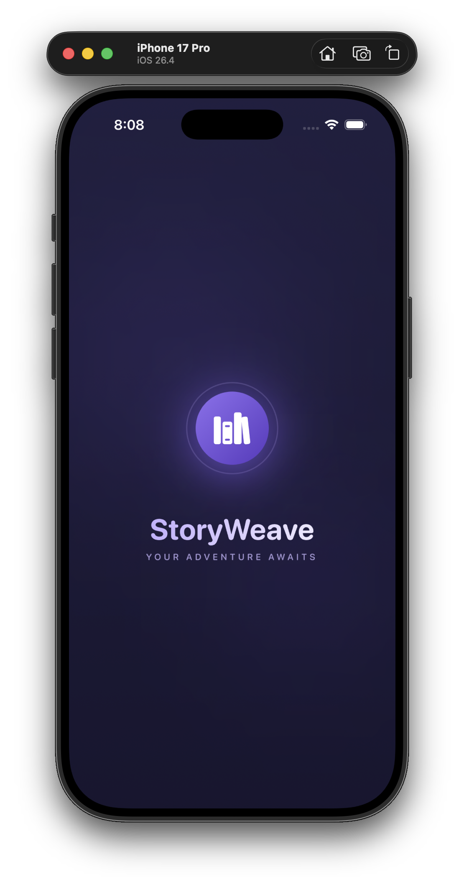 | 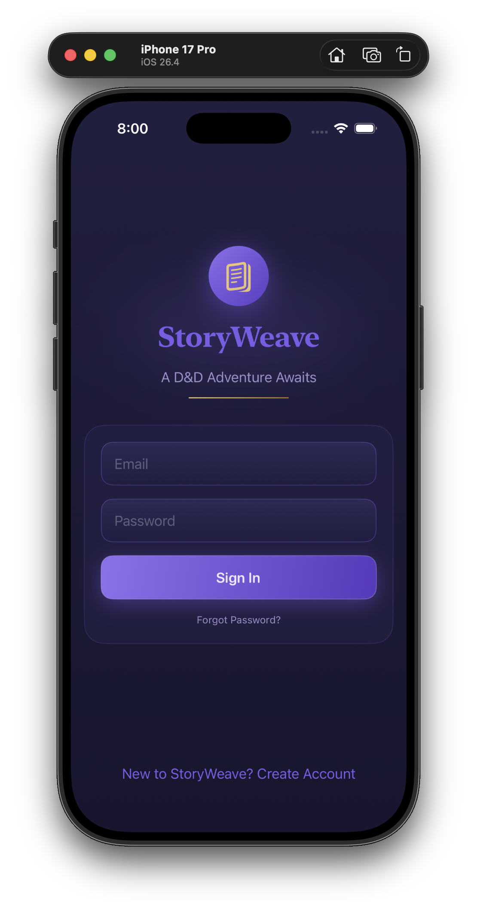 | 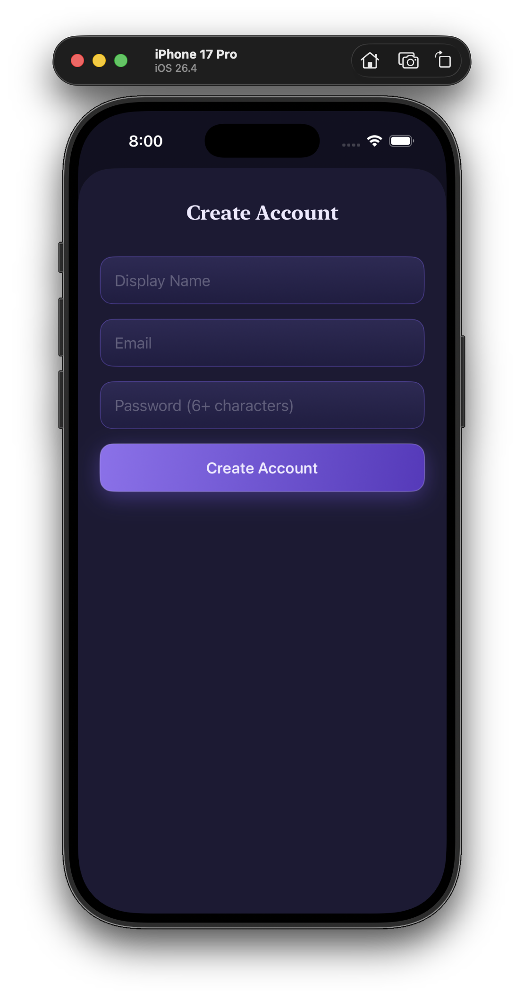 |

---

### Profile & Game Analytics

- Avatar upload via Cloudinary (compressed to 800 px max) with live circular preview and a "Change Photo" prompt.
- Display name badge and email shown beneath the avatar; "Adventuring since" join date displayed below.
- **Stats tab** — six analytics tiles: Combats Won, Combats Lost, Acts Done, Heroes Lost, Skill Checks attempted, and total Playtime.
- Combat win-rate progress bar and skill-check accuracy percentage summarise overall performance.
- **Inventory tab** — every item the player carries across all game runs, with description text and a quantity badge on the right.
- Sign Out button at the bottom of the profile screen.

| Profile — Stats (top)                          | Profile — Analytics Detail                           | Profile — Inventory                            |
| ---------------------------------------------- | ---------------------------------------------------- | ---------------------------------------------- |
| 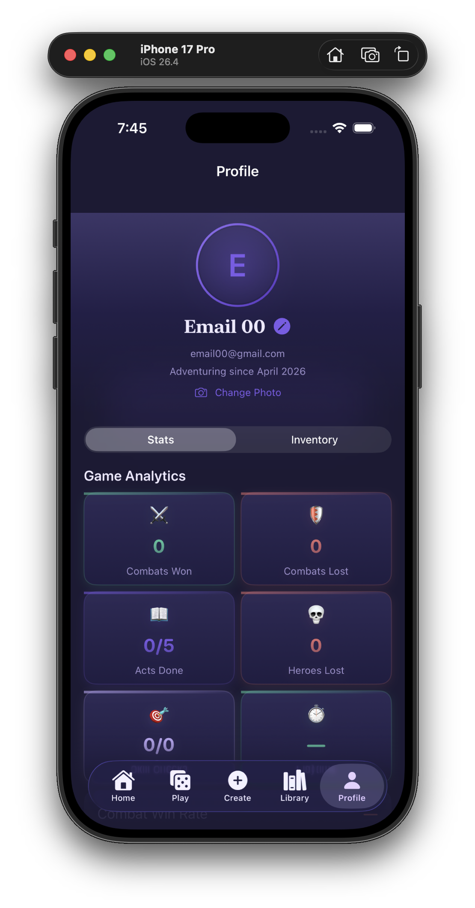 | 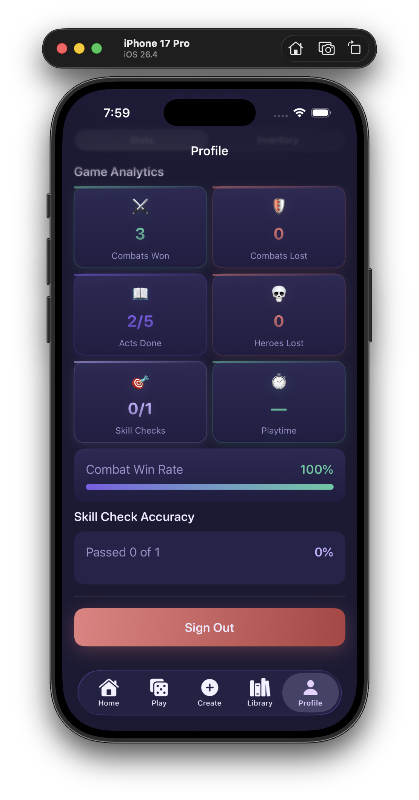 | 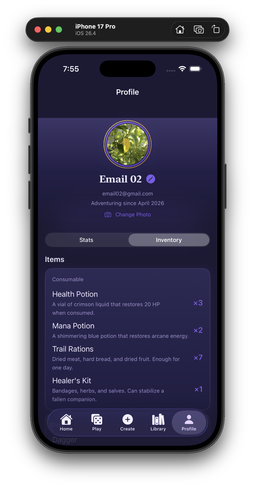 |

---

### Library

- Searchable character browser; query matches name or archetype substring in real time.
- Each character row shows archetype icon, HP, ATK, and DEF at a glance.
- Searchable skill browser; query matches name or stat name.
- Each skill row shows name, description, affected-stat chip, modifier value, cooldown turns, and a colour-coded target-type badge (Enemy in red, Ally in teal, Self in muted purple).

| Characters                                                   | Skills                                               |
| ------------------------------------------------------------ | ---------------------------------------------------- |
| 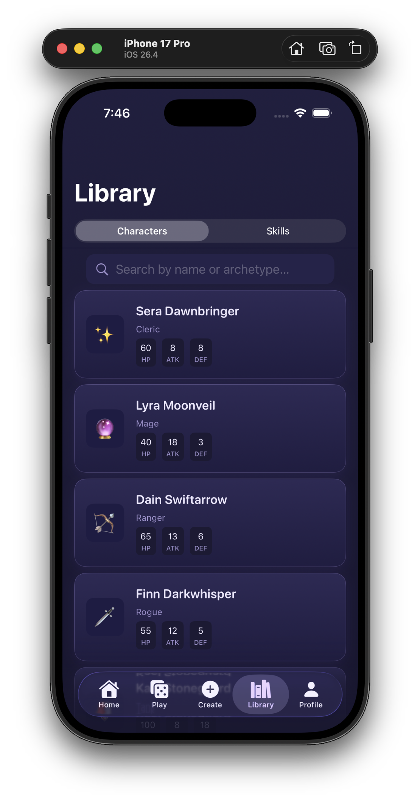 | 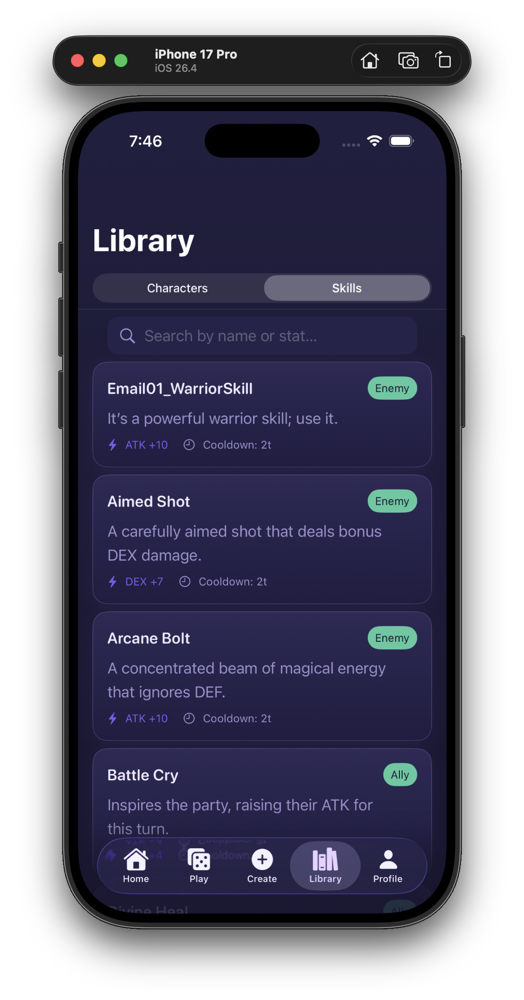 |

---

### Create Hub

A central plus-tab action hub exposes four creation flows:

| Create Hub                                      | New Post                                        | New Character                                             | New Skill                                         |
| ----------------------------------------------- | ----------------------------------------------- | --------------------------------------------------------- | ------------------------------------------------- |
| 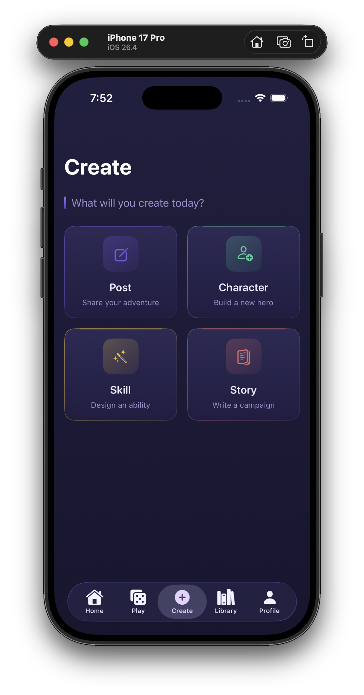 | 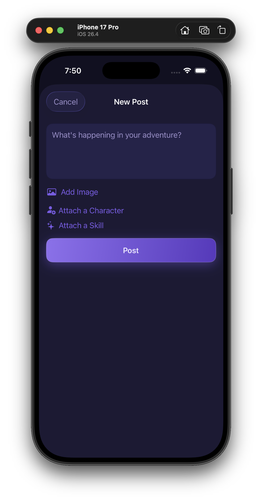 | 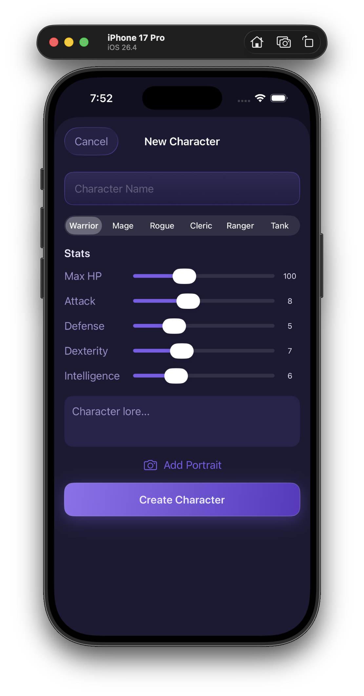 | 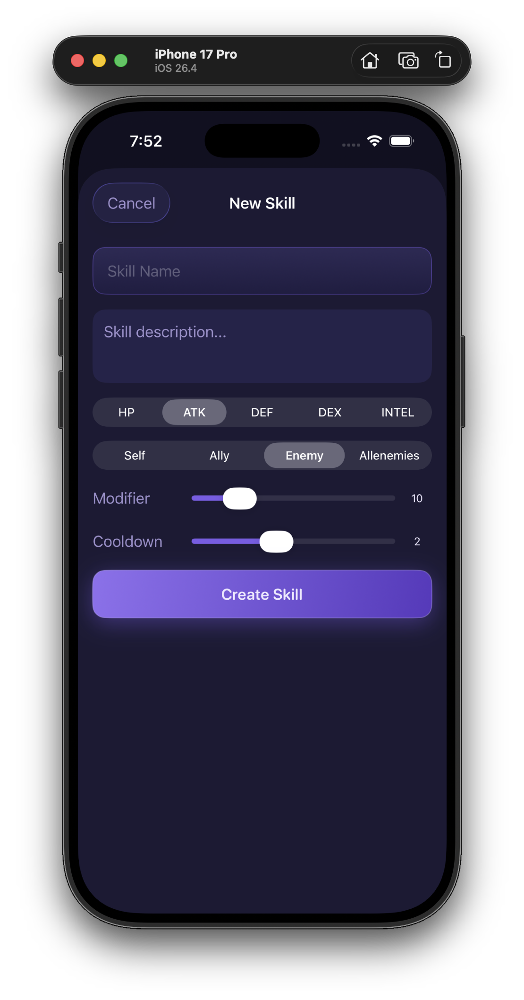 |

- **Post** — rich text body, optional Cloudinary image attachment, optional character card or skill card attachment.
- **Character** — name field, archetype chip row (Warrior / Mage / Rogue / Cleric / Ranger / Tank), five stat sliders (Max HP, Attack, Defense, Dexterity, Intelligence), free-text lore description, and portrait upload.
- **Skill** — name, description, stat-affected chip row (HP / ATK / DEF / DEX / INTEL), target-type chip row (Self / Ally / Enemy / AllEnemies), modifier slider, and cooldown turns slider.
- **Story** — three-step wizard: ① Story Info (title + synopsis) → ② Scenes (add up to 40 scenes, each with scene type, narration text, branching choices, and optional combat/skill-check config) → ③ Review & Publish.

| Create Story Wizard                              |
| ------------------------------------------------ |
| 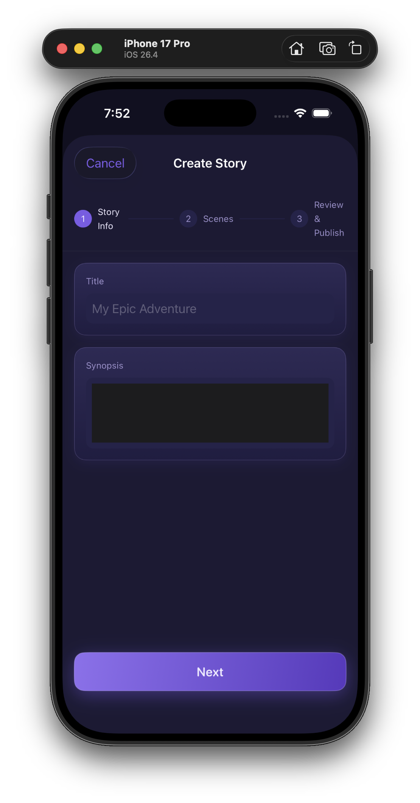 |

---

### Community Feed

- Global social feed aggregates all users' posts in reverse-chronological order with real-time Firestore snapshot listener.
- Post cards show author avatar initial, display name, relative timestamp, body text, and an inline character or skill card preview where attached.
- Full-screen post detail view shows emoji reaction row (❤️ 😂 😮 👏), like count, and a scrollable comment section.
- Comments support one level of threaded replies; reply indentation is shown inline.
- Post authors can edit or delete their own posts via an overflow menu (⋯).

| Feed                                   | Post Detail                                     | Comments & Replies                                             |
| -------------------------------------- | ----------------------------------------------- | -------------------------------------------------------------- |
| 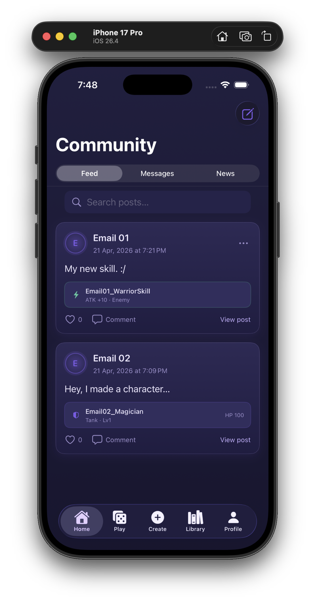 | 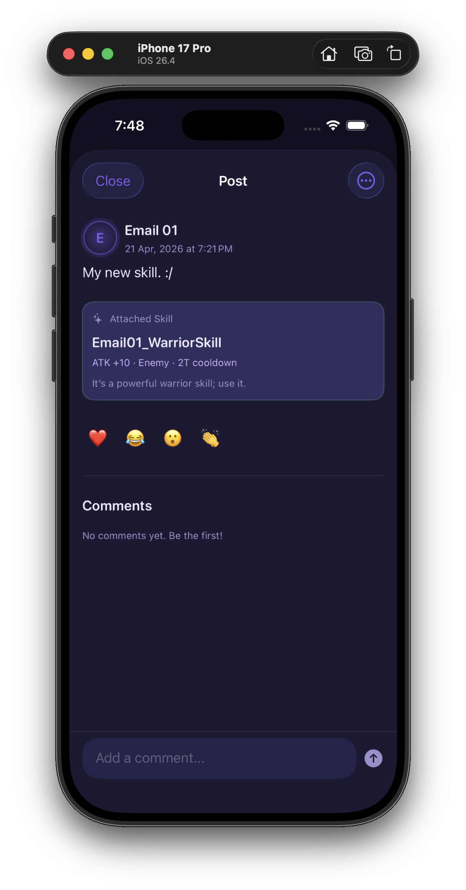 | 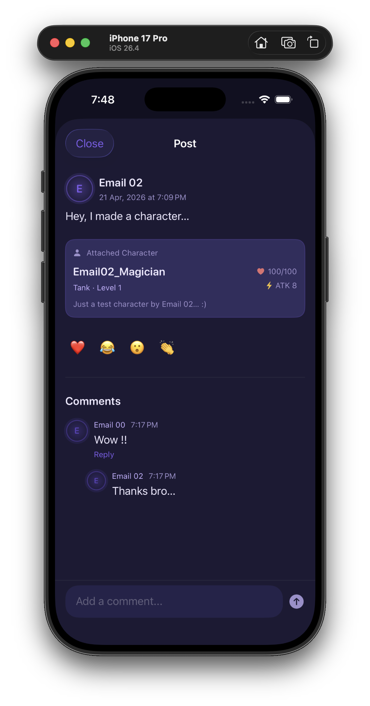 |

---

### News Feed

- Dedicated News tab inside the Community screen surfaces live tech and gaming headlines fetched via `NewsService`.
- Article cards display a full-width banner image, source name badge, publication timestamp, headline, and a two-line excerpt with a "Read full article" affordance.

| News                                                |
| --------------------------------------------------- |
| 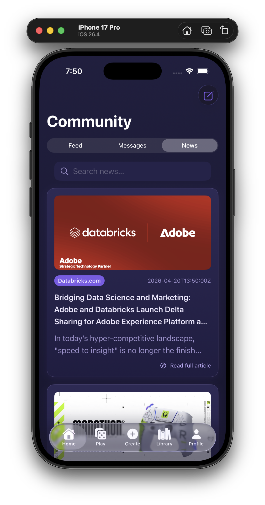 |

---

### Direct Messaging

- **People tab** lists all registered users; a "Message" button appears only for accepted connections.
- Incoming connection requests appear in a card with Accept ✓ and Decline ✗ buttons.
- One-on-one conversation screen: sender bubbles are purple (right), receiver bubbles are dark (left), each with a timestamp below.
- Conversation list (Messages tab) shows latest message preview, peer name, and elapsed time badge; updates in real time via Firestore listener.

| Connection Request                                             | Chat Window                                 | Conversation List                               |
| -------------------------------------------------------------- | ------------------------------------------- | ----------------------------------------------- |
| 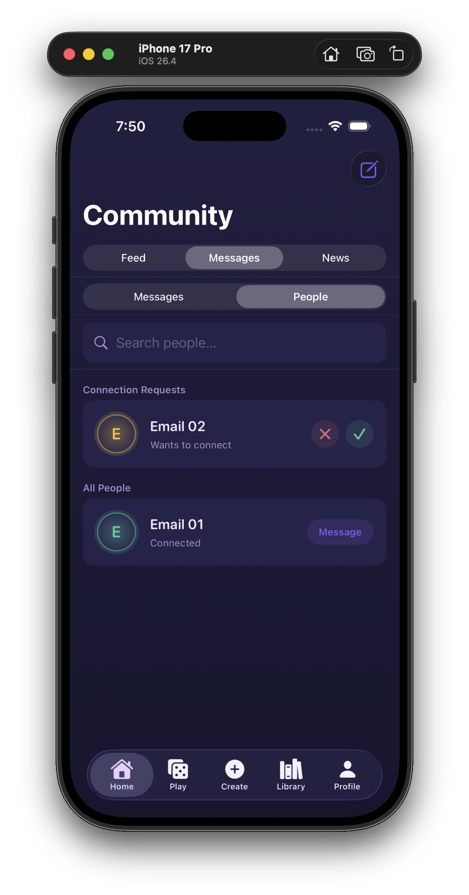 | 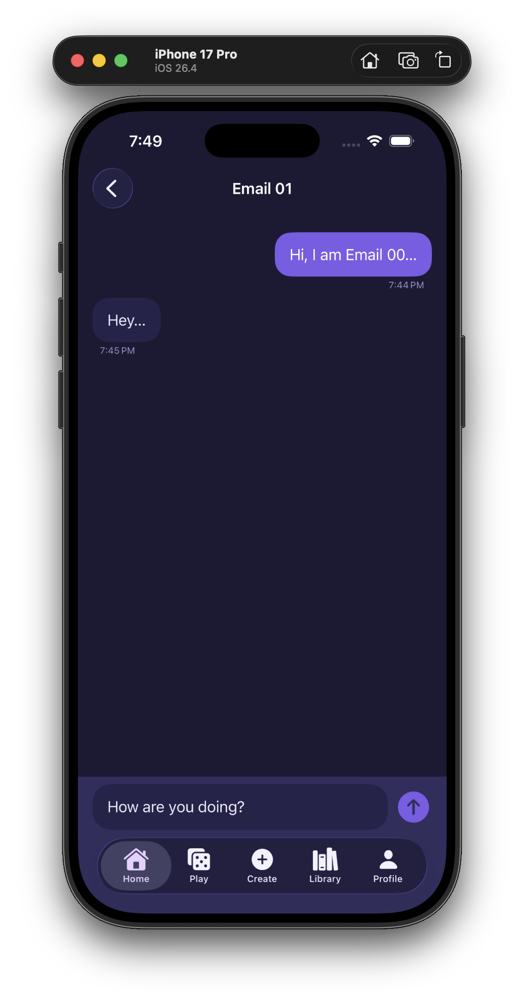 | 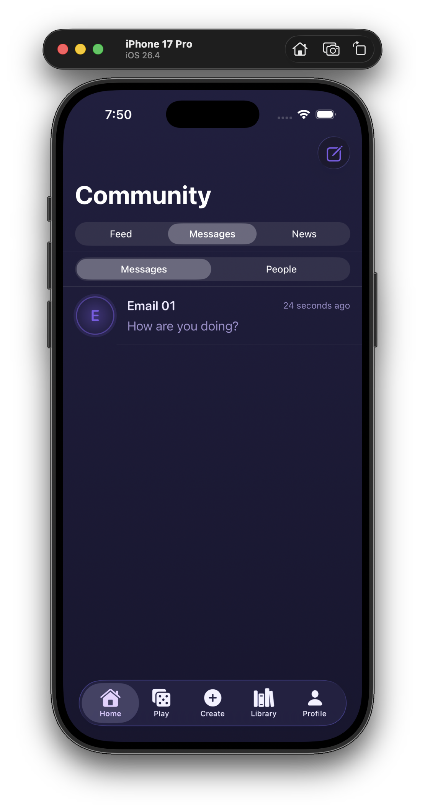 |

---

### Game — Party Assembly

- Three tabs in the Play screen: **Campaign** (built-in five-act story), **Community** (user-published stories), **Sessions** (multiplayer lobbies).
- Party assembly screen: bot companion count slider (1–5), character browser in list or grid layout, tap a card to toggle BOT / HERO designation (star badge for hero).
- "Begin Adventure" button activates once a hero is selected; bot companions fill remaining slots.
- A **Multiplayer** button opens a session lobby where players are invited by UID and given characters.

| Community Stories                                       | Character Grid                                                   | Select Hero                                              |
| ------------------------------------------------------- | ---------------------------------------------------------------- | -------------------------------------------------------- |
| 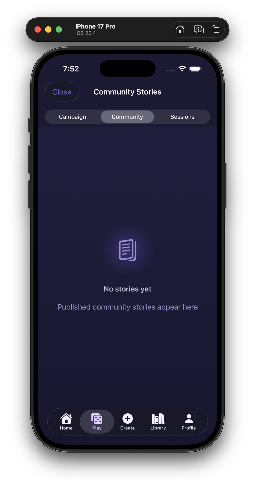 | 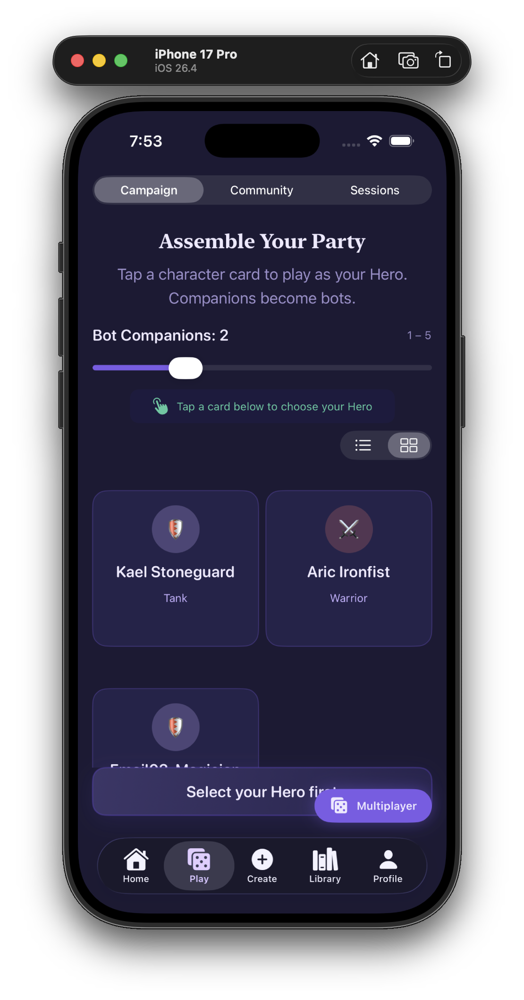 | 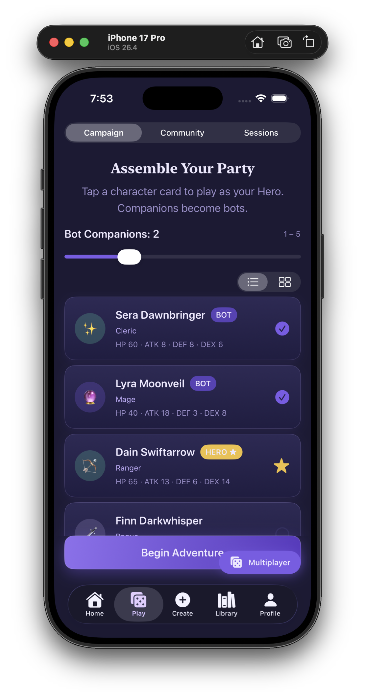 |

---

### Game — Scene Engine

Four scene types drive the narrative:

**Exploration** — Act title shown in a styled header. Gemini-narrated text panel fills the centre. Up to four branching choice buttons sit below. Party member health bars are pinned to the bottom with archetype icon, name abbreviation, and a colour-coded HP bar.

**Combat** — Two-row battlefield: emoji-avatar enemies (with name labels and red HP bars) in the top row; party members (with archetype icons and green/amber HP bars) in the bottom row. Player-turn action panel shows Attack, Defend, and Skill buttons. On bot and enemy turns, each action resolves live and appends a line to the combat log (e.g. "Sera Dawnbringer attacks Goblin Scout for 6", "criticalFail").

**Skill Check** — Narrative context card shown at top. A stat badge (e.g. DEX) and DC number indicate the challenge. A large "Roll d20" button triggers a `rotation3DEffect`-powered dice animation; the resolved number appears with a green or red colour depending on pass/fail.

| Exploration                                      | Combat — Player Turn                      | Combat — Enemy Turn                              |
| ------------------------------------------------ | ----------------------------------------- | ------------------------------------------------ |
| 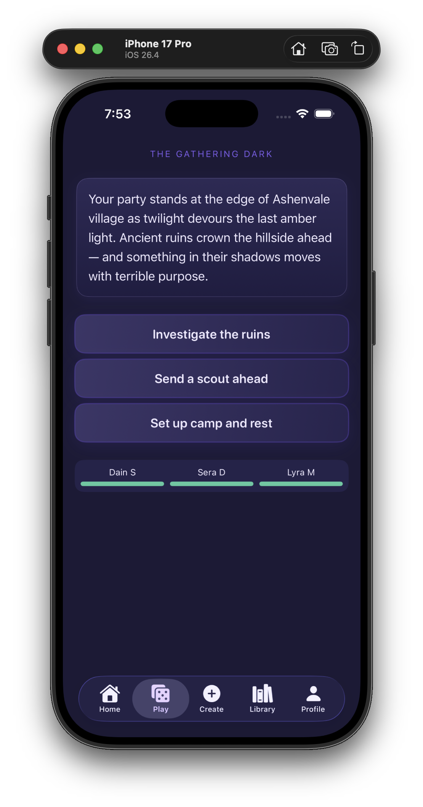 | 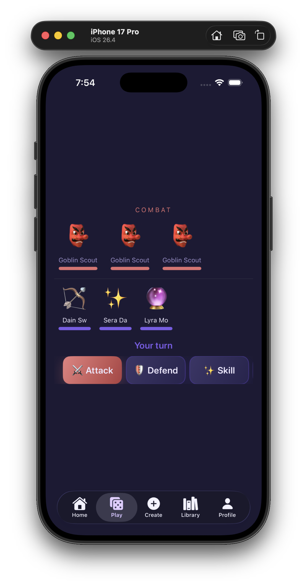 | 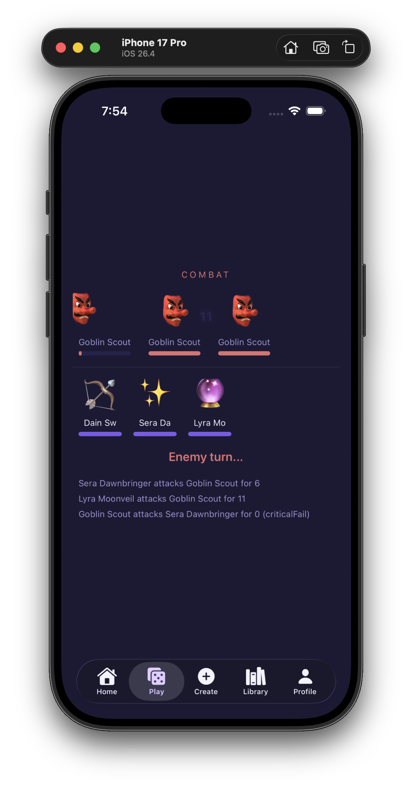 |

| Combat Continued                                          | Skill Check                                           | Dice Roll Animation                                           |
| --------------------------------------------------------- | ----------------------------------------------------- | ------------------------------------------------------------- |
| 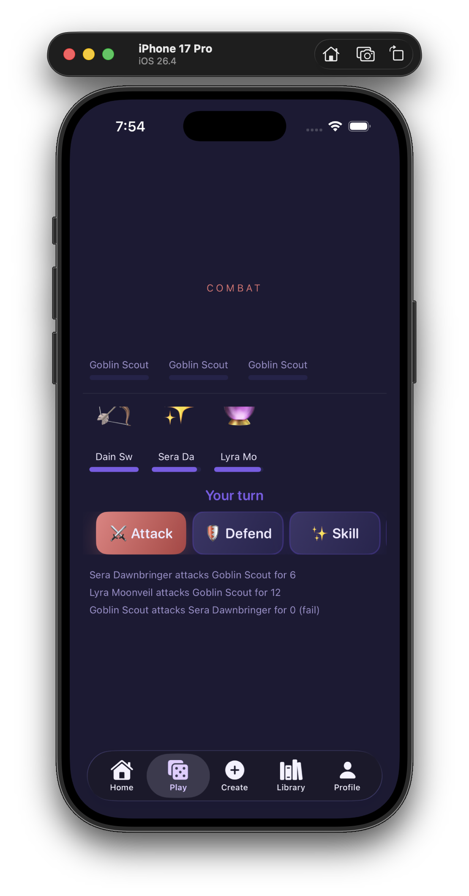 | 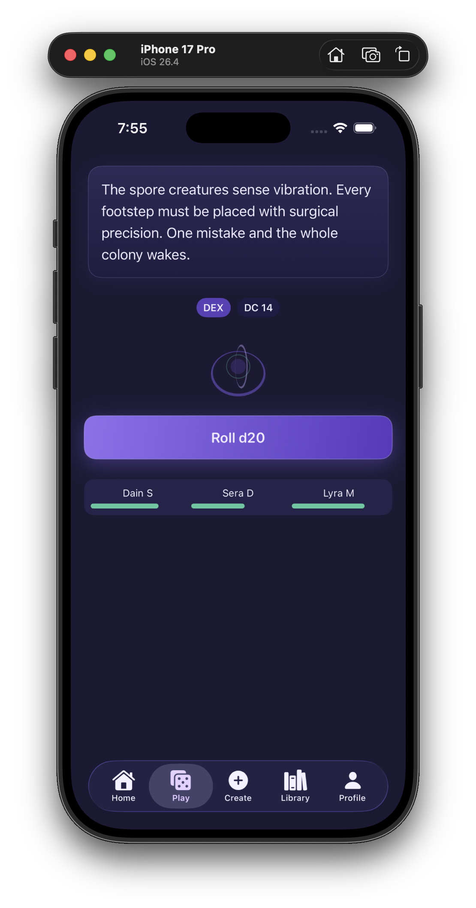 | 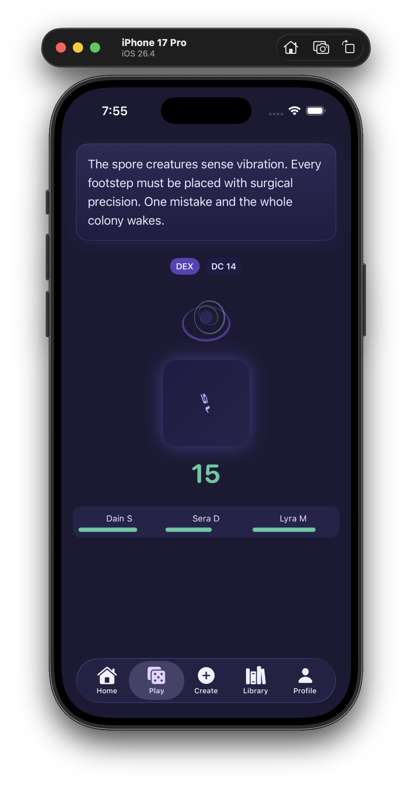 |

---

## Architecture

The app follows a strict MVVM architecture with a service-oriented domain layer, enforcing Swift 6 strict concurrency via `SWIFT_DEFAULT_ACTOR_ISOLATION = MainActor`.

### View Layer (SwiftUI)

All screens live under `Views/` organised by feature:

```
Views/
├── Auth/        AuthView
├── Chat/        ChatView · ConversationView · MySessionsView
├── Effects/     DeathOverlay · particle effects
├── Game/        GameView · ExplorationView · CommunityStoriesView
├── Home/        HomeView · PostCardView · PostDetailView
│                NewsView · NewsCardView
├── Library/     LibraryView
├── Plus/        ActionHubView · CreateCharacterView · CreatePostView
│                CreateSkillView · CharacterBrowserView · SkillBrowserView
├── Profile/     ProfileView
├── SplashScreenView.swift
└── MainTabView.swift
```

Views contain zero business logic. All state reads and mutations go through a bound ViewModel.

### ViewModel Layer

Each screen owns a dedicated `@MainActor final class … : ObservableObject`:

| ViewModel                   | Responsibility                                                   |
| --------------------------- | ---------------------------------------------------------------- |
| `AuthViewModel`             | Sign-in / Sign-up / Sign-out state                               |
| `GameViewModel`             | Scene engine, combat loop, Gemini narration streaming, auto-save |
| `MultiplayerViewModel`      | GameSession lobby, real-time turn synchronisation                |
| `StoryBuilderViewModel`     | Multi-step story authoring wizard and Firestore publish          |
| `CommunityStoriesViewModel` | Published user-story list                                        |
| `ConversationViewModel`     | Real-time chat message stream                                    |
| `ChatViewModel`             | Conversation list and connection-request management              |
| `HomeViewModel`             | Post feed, likes, emoji reactions, comments, replies             |
| `NewsViewModel`             | Tech and gaming news articles                                    |
| `CreatePostViewModel`       | Post form state and Cloudinary image upload                      |
| `CreateCharacterViewModel`  | Character form validation and Firestore write                    |
| `CreateSkillViewModel`      | Skill form validation and Firestore write                        |
| `CharacterBrowserViewModel` | Character list with live search/filter                           |
| `SkillBrowserViewModel`     | Skill list with live search/filter                               |
| `ProfileViewModel`          | Analytics display, avatar upload, sign-out                       |
| `InventoryViewModel`        | Player inventory item display                                    |

### Service Layer

| Service             | Role                                                                              |
| ------------------- | --------------------------------------------------------------------------------- |
| `FirestoreService`  | All Firestore reads, writes, and real-time snapshot listeners                     |
| `AuthService`       | Firebase Auth session lifecycle, current UID access                               |
| `GeminiService`     | Streamed narrative generation — Gemini Flash 2.0 SSE API                          |
| `CloudinaryService` | Image compression to 800 px and upload; returns URL string                        |
| `NewsService`       | Fetches tech/gaming news from external REST API                                   |
| `HapticEngine`      | Centralised `UIImpactFeedbackGenerator` / `UINotificationFeedbackGenerator` calls |
| `SecretsManager`    | Reads `Secrets.plist` for API keys at runtime                                     |

### Game Engine Layer

```
Game/
├── CampaignStoryProvider   — hard-coded 5-act, 25+ scene graph
├── UserStoryProvider       — runtime scene graph from UserStory model
├── SceneManager            — evaluates game-over / completion conditions
├── DefaultContent          — seeds 6 characters · 12 skills · 8 inventory items
└── BotAI                   — role-based bot action selection per archetype
```

`GameViewModel` depends only on the `StoryProvider` protocol, making both campaign and community-story runs use the identical code path.

### Persistence

| Data                 | Store                                            |
| -------------------- | ------------------------------------------------ |
| Auth session         | Firebase Auth keychain                           |
| Structured app data  | Firebase Firestore (offline persistence enabled) |
| Images and portraits | Cloudinary CDN                                   |
| API keys             | Bundled `Secrets.plist` (git-ignored)            |
| Local UI state       | `@State` / `@StateObject` / `@AppStorage`        |

---

## Project Structure

```
storyweave/
├── storyweave/
│   ├── StoryWeaveApp.swift
│   ├── DesignSystem/
│   │   ├── Colors.swift
│   │   └── Components.swift
│   ├── Models/
│   │   ├── Character.swift       Skill.swift        Post.swift
│   │   ├── Comment.swift         Reaction.swift     UserProfile.swift
│   │   ├── GameState.swift       GameAnalytics.swift GameSession.swift
│   │   ├── InventoryItem.swift   UserStory.swift    Connection.swift
│   │   ├── Conversation.swift    ChatMessage.swift  NewsArticle.swift
│   │   └── Enums.swift
│   ├── Services/
│   │   ├── AuthService.swift     FirestoreService.swift  GeminiService.swift
│   │   ├── CloudinaryService.swift  NewsService.swift
│   │   ├── HapticEngine.swift    SecretsManager.swift
│   ├── ViewModels/               (16 view models — see Architecture)
│   ├── Views/                    (feature folders — see Architecture)
│   ├── Game/
│   │   ├── CampaignStoryProvider.swift   UserStoryProvider.swift
│   │   ├── SceneManager.swift            DefaultContent.swift
│   │   └── BotAI.swift
│   ├── PropertyWrappers/
│   ├── Assets.xcassets
│   ├── GoogleService-Info.plist
│   └── Secrets.plist
├── storyweave.xcodeproj/
├── docs/
└── images/
```

---

## Data Model / Entity Relationships

**Figure-1: Database Schema of StoryWeave App**

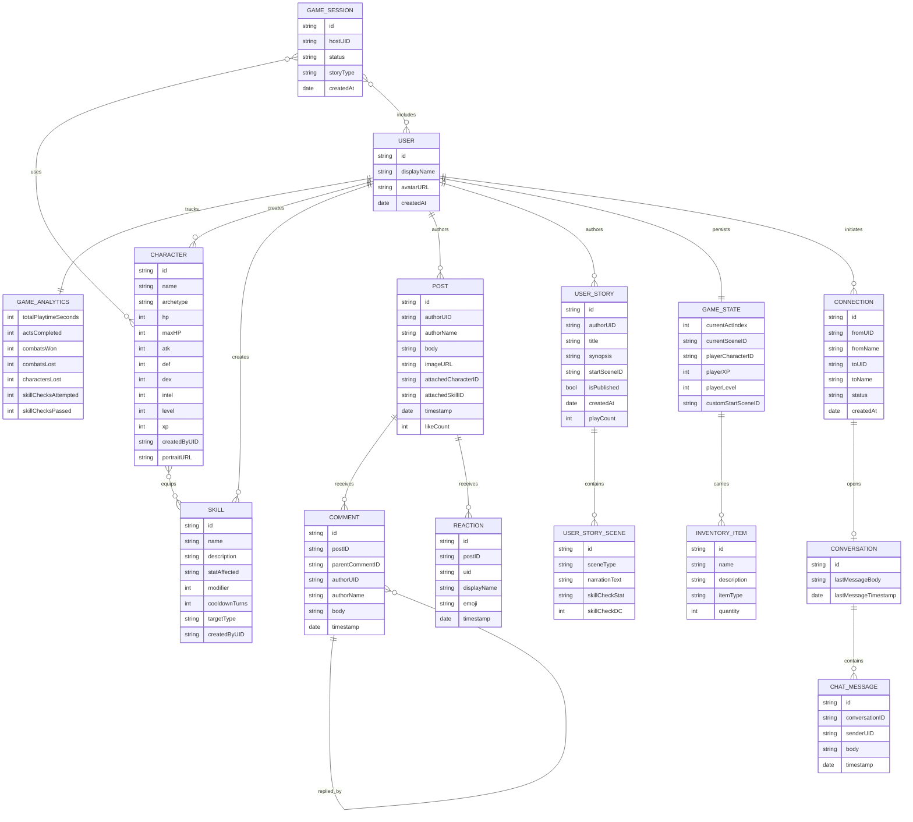
```mermaid
erDiagram
    USER {
        string id
        string displayName
        string avatarURL
        date   createdAt
    }
    GAME_ANALYTICS {
        int totalPlaytimeSeconds
        int actsCompleted
        int combatsWon
        int combatsLost
        int charactersLost
        int skillChecksAttempted
        int skillChecksPassed
    }
    CHARACTER {
        string id
        string name
        string archetype
        int    hp
        int    maxHP
        int    atk
        int    def
        int    dex
        int    intel
        int    level
        int    xp
        string createdByUID
        string portraitURL
    }
    SKILL {
        string id
        string name
        string description
        string statAffected
        int    modifier
        int    cooldownTurns
        string targetType
        string createdByUID
    }
    POST {
        string id
        string authorUID
        string authorName
        string body
        string imageURL
        string attachedCharacterID
        string attachedSkillID
        date   timestamp
        int    likeCount
    }
    COMMENT {
        string id
        string postID
        string parentCommentID
        string authorUID
        string authorName
        string body
        date   timestamp
    }
    REACTION {
        string id
        string postID
        string uid
        string displayName
        string emoji
        date   timestamp
    }
    GAME_STATE {
        int    currentActIndex
        string currentSceneID
        string playerCharacterID
        int    playerXP
        int    playerLevel
        string customStartSceneID
    }
    INVENTORY_ITEM {
        string id
        string name
        string description
        string itemType
        int    quantity
    }
    CONNECTION {
        string id
        string fromUID
        string fromName
        string toUID
        string toName
        string status
        date   createdAt
    }
    CONVERSATION {
        string id
        string lastMessageBody
        date   lastMessageTimestamp
    }
    CHAT_MESSAGE {
        string id
        string conversationID
        string senderUID
        string body
        date   timestamp
    }
    USER_STORY {
        string id
        string authorUID
        string title
        string synopsis
        string startSceneID
        bool   isPublished
        date   createdAt
        int    playCount
    }
    USER_STORY_SCENE {
        string id
        string sceneType
        string narrationText
        string skillCheckStat
        int    skillCheckDC
    }
    GAME_SESSION {
        string id
        string hostUID
        string status
        string storyType
        date   createdAt
    }

    USER              ||--||  GAME_ANALYTICS   : "tracks"
    USER              ||--o{  CHARACTER         : "creates"
    USER              ||--o{  SKILL             : "creates"
    USER              ||--o{  POST              : "authors"
    USER              ||--o{  USER_STORY        : "authors"
    USER              ||--||  GAME_STATE        : "persists"
    GAME_STATE        ||--o{  INVENTORY_ITEM    : "carries"
    CHARACTER         }o--o{  SKILL             : "equips"
    POST              ||--o{  COMMENT           : "receives"
    POST              ||--o{  REACTION          : "receives"
    COMMENT           ||--o{  COMMENT           : "replied_by"
    USER              ||--o{  CONNECTION        : "initiates"
    CONNECTION        ||--o|  CONVERSATION      : "opens"
    CONVERSATION      ||--o{  CHAT_MESSAGE      : "contains"
    USER_STORY        ||--o{  USER_STORY_SCENE  : "contains"
    GAME_SESSION      }o--o{  CHARACTER         : "uses"
    GAME_SESSION      }o--o{  USER              : "includes"
```

---

## Firestore Collections

| Collection Path                            | Document Type                   | Notes                                          |
| ------------------------------------------ | ------------------------------- | ---------------------------------------------- |
| `/users/{uid}`                             | `UserProfile` + `GameAnalytics` | One document per authenticated user            |
| `/characters/{characterID}`                | `Character`                     | System + user-created; publicly readable       |
| `/skills/{skillID}`                        | `Skill`                         | System + user-created; publicly readable       |
| `/posts/{postID}`                          | `Post`                          | Social feed; publicly readable                 |
| `/posts/{postID}/reactions/{uid}`          | `Reaction`                      | One reaction per user per post                 |
| `/posts/{postID}/comments/{commentID}`     | `Comment`                       | Top-level and reply comments                   |
| `/gameSaves/{uid}`                         | `GameState`                     | One save per user; offline persistence enabled |
| `/connections/{pairID}`                    | `Connection`                    | `pairID` = sorted UIDs joined by `_`           |
| `/conversations/{pairID}`                  | `Conversation`                  | Mirrors connection pair                        |
| `/conversations/{pairID}/messages/{msgID}` | `ChatMessage`                   | Real-time snapshot listener                    |
| `/userStories/{storyID}`                   | `UserStory` (+ embedded scenes) | Community-published adventures                 |
| `/gameSessions/{sessionID}`                | `GameSession`                   | Multiplayer sessions with embedded `GameState` |
| `/meta/seed_v1`                            | sentinel                        | Written once; gates default content seeding    |

---

## Use Case Diagram

**Figure-2: Use Case Diagram of StoryWeave App**


```mermaid
flowchart TD
    Player(["👤 Player"])
    PeerUser(["👥 Peer User"])

    subgraph Auth["Authentication"]
        UC_SignIn["Sign In"]
        UC_SignUp["Sign Up / Create Account"]
        UC_ForgotPwd["Reset Password"]
    end

    subgraph Social["Community & Social"]
        UC_Feed["Browse Community Feed"]
        UC_Post["Create Post"]
        UC_React["React with Emoji / Like"]
        UC_Comment["Comment & Reply"]
        UC_News["Read Tech & Gaming News"]
    end

    subgraph Msg["Direct Messaging"]
        UC_ConnReq["Send Connection Request"]
        UC_Approve["Approve / Decline Request"]
        UC_Chat["Send & Receive Messages"]
    end

    subgraph Lib["Library"]
        UC_BrowseChars["Browse Characters"]
        UC_BrowseSkills["Browse Skills"]
    end

    subgraph Create["Create"]
        UC_CreateChar["Create Character"]
        UC_CreateSkill["Create Skill"]
        UC_CreatePost["Compose Post"]
        UC_CreateStory["Build & Publish Story"]
    end

    subgraph Game["Game"]
        UC_Campaign["Play Campaign"]
        UC_CommStory["Play Community Story"]
        UC_Multiplayer["Join Multiplayer Session"]
        UC_Assemble["Assemble Party"]
        UC_Explore["Exploration Scene"]
        UC_Combat["Combat Scene"]
        UC_SkillCheck["Skill Check Scene"]
        UC_AutoSave["Auto-Save Progress"]
    end

    subgraph Profile["Profile"]
        UC_Stats["View Game Analytics"]
        UC_Inventory["View Inventory"]
        UC_Photo["Update Avatar Photo"]
        UC_SignOut["Sign Out"]
    end

    Player --> Auth
    Player --> Social
    Player --> Msg
    Player --> Lib
    Player --> Create
    Player --> Game
    Player --> Profile

    UC_Campaign    --> UC_Assemble
    UC_CommStory   --> UC_Assemble
    UC_Multiplayer --> UC_Assemble
    UC_Assemble    --> UC_Explore
    UC_Explore     --> UC_Combat
    UC_Explore     --> UC_SkillCheck
    UC_Combat      --> UC_AutoSave
    UC_SkillCheck  --> UC_AutoSave

    PeerUser --> UC_Approve
    PeerUser --> UC_Chat
    PeerUser --> UC_Feed
    PeerUser --> UC_React
```

---

## Activity Diagram

**Figure-3: Activity Diagram of StoryWeave App**

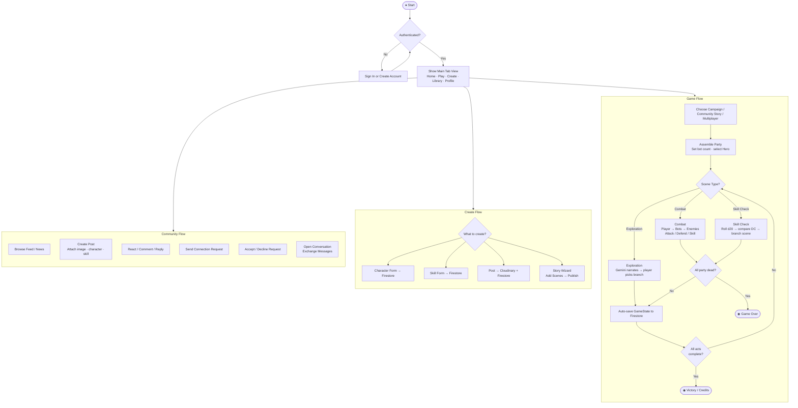
```mermaid
flowchart TD
    Start(["●  Start"])
    Auth{"Authenticated?"}
    AuthAction["Sign In or Create Account"]
    Main["Show Main Tab View\nHome · Play · Create · Library · Profile"]

    subgraph SocialFlow["Community Flow"]
        direction TB
        S1["Browse Feed / News"]
        S2["Create Post\nAttach image · character · skill"]
        S3["React / Comment / Reply"]
        S4["Send Connection Request"]
        S5["Accept / Decline Request"]
        S6["Open Conversation\nExchange Messages"]
    end

    subgraph CreateFlow["Create Flow"]
        direction TB
        CF{"What to create?"}
        CF1["Character Form → Firestore"]
        CF2["Skill Form → Firestore"]
        CF3["Post → Cloudinary + Firestore"]
        CF4["Story Wizard\nAdd Scenes → Publish"]
    end

    subgraph GameFlow["Game Flow"]
        direction TB
        G1["Choose Campaign / Community Story / Multiplayer"]
        G2["Assemble Party\nSet bot count · select Hero"]
        G3{"Scene Type?"}
        G4["Exploration\nGemini narrates → player picks branch"]
        G5["Combat\nPlayer → Bots → Enemies\nAttack / Defend / Skill"]
        G6["Skill Check\nRoll d20 → compare DC → branch scene"]
        G7{"All party dead?"}
        G8["Auto-save GameState to Firestore"]
        G9{"All acts\ncomplete?"}
        GameOver(["◉  Game Over"])
        End(["◉  Victory / Credits"])
    end

    Start --> Auth
    Auth -- No --> AuthAction --> Auth
    Auth -- Yes --> Main

    Main --> SocialFlow
    Main --> CreateFlow
    Main --> GameFlow

    CF --> CF1 & CF2 & CF3 & CF4

    G1 --> G2 --> G3
    G3 -- Exploration --> G4 --> G8 --> G9
    G3 -- Combat --> G5 --> G7
    G3 -- Skill Check --> G6 --> G7
    G7 -- Yes --> GameOver
    G7 -- No --> G8
    G9 -- Yes --> End
    G9 -- No --> G3
```

---

## Team Contributions

**Md. Shifat Hasan:**
_Game Engine, Social Feed & News_

Designed and implemented the entire game engine: the `StoryProvider` protocol and both concrete providers (`CampaignStoryProvider` and `UserStoryProvider`), `SceneManager`, `GameViewModel`, and `DefaultContent` seeding. Built the turn-based combat system including role-based bot AI (`BotAI`) for all six archetypes, D20 outcome resolution (`CombatOutcome`), skill-check branching, and party-death/game-over logic, with Basher providing supplementary support on gameplay integration. Integrated Google Gemini Flash~2.0 via Server-Sent Events into `GeminiService` returning an `AsyncThrowingStream<String, Error>` for typewriter-style streamed narration, resolving Swift~6 actor-boundary challenges. Implemented all SwiftUI-only visual effects: `rotation3DEffect` dice roll animation, hit flash overlays, death desaturation via `Canvas`, and level-up particle bursts using `TimelineView`. Also built the community social feed (`HomeViewModel`, `PostCardView`, `PostDetailView`, emoji reactions, threaded comments), the Create Post form, the tech/gaming news tab (`NewsService`, `NewsViewModel`, `NewsCardView`), and the multiplayer `GameSession` system.

**Md. Siam Basher:**
_Direct Messaging, Character & Skill Creation, Story Publish_

Built the full direct-messaging system end-to-end: `Connection` and `Conversation` Firestore models, connection-request approval/decline flow, `ConversationViewModel` consuming a real-time Firestore `addSnapshotListener` bridged into an `AsyncStream`, `ChatView`, and `ConversationView` with colour-coded message bubbles. Implemented `CreateCharacterView` with archetype chip-row and five stat sliders, and `CreateSkillView` with stat and target-type chip rows, including their respective view models and Firestore write flows. Completed the final step of the community story builder wizard — the Review & Publish screen (`StoryBuilderViewModel` publish flow, Firestore write of `UserStory`). Also provided supplementary support on game engine integration.

**Afifa Sultana:**
_Authentication, Profile + Library Tab & Story Creation_

Implemented all Firebase Auth flows: sign-in, account creation with display-name provisioning, password-reset email, and session-aware routing in `StoryWeaveApp`. Built the entire Profile tab: `ProfileViewModel`, Cloudinary-backed avatar upload with live circular preview, game-analytics tile grid (Combats Won/Lost, Acts Done, Heroes Lost, Skill Checks, Playtime), combat win-rate and skill-check accuracy progress indicators, inventory list via `InventoryViewModel`, and the Sign Out button. The Library character and skill browsers (`CharacterBrowserViewModel`, `SkillBrowserViewModel`, `LibraryView`). Implemented the first two steps of the community story builder wizard — Story Info (title and synopsis) and the Scenes editor (scene type, narration text, branching choices, combat and skill-check configuration per scene).

---

## Discussion

A significant technical challenge was integrating Google Gemini's SSE streaming API within Swift 6's strict actor isolation. `GeminiService` returns an `AsyncThrowingStream<String, Error>` from a `nonisolated` method, and `GameViewModel` — pinned to `@MainActor` — must progressively append tokens to `@Published var narration` without data races. The solution was to open a detached `Task` inside the ViewModel that consumes the stream with `for try await`, writing each chunk to `@MainActor` state, and cancels via a stored `Task` reference on every scene transition.

A second challenge was designing a story engine that handles both the hard-coded five-act campaign and arbitrary user-authored adventures through the same code path. Introducing a `StoryProvider` protocol implemented by `CampaignStoryProvider` and `UserStoryProvider` allowed `GameViewModel` to remain provider-agnostic. Swapping the provider at game-start is sufficient to run any story type with zero branching logic in the engine itself.

A third challenge involved bridging Firestore's callback-based snapshot listeners into the Swift async/await world for real-time chat. Wrapping each `addSnapshotListener` call in an `AsyncStream { continuation in … }` inside `FirestoreService` exposed a typed async sequence that `ConversationViewModel` could consume with `for await` on the `@MainActor`, satisfying Swift 6 Sendable requirements while delivering sub-second message delivery.

Finally, building all animations — dice rolls, combat screen shakes, death dissolves, level-up glows — entirely in SwiftUI without external assets required creative use of `TimelineView`, `Canvas`, `GeometryEffect`, and `rotation3DEffect`. Confining particle-system draw calls to `TimelineView` with a `.animation` schedule prevented layout passes on every frame tick and maintained a smooth 60 fps throughout combat sequences.

---

## Conclusion

StoryWeave delivers a complete, production-quality iOS experience combining a five-act AI-narrated RPG with a real-time social community. Swift 6 strict concurrency, MVVM architecture, and the `StoryProvider` protocol made the game engine fully decoupled from both the campaign content and the social layer, enabling all three of them to evolve independently. Firebase Firestore's offline persistence means game saves survive network interruptions, while Gemini Flash 2.0 streaming keeps narrative latency imperceptible. The project provided hands-on experience in streaming API integration, protocol-driven game-engine design, actor-safe real-time data pipelines, and building complex animations purely from SwiftUI primitives — demonstrating that modern iOS frameworks are capable of powering immersive, multi-user interactive experiences without a single external asset file.

---

## References

- [Apple Developer — SwiftUI Documentation](https://developer.apple.com/documentation/swiftui)
- [Apple Developer — Swift Concurrency](https://developer.apple.com/documentation/swift/concurrency)
- [Firebase iOS SDK Setup](https://firebase.google.com/docs/ios/setup)
- [Firebase Firestore](https://firebase.google.com/docs/firestore)
- [Google Gemini API — Streaming](https://ai.google.dev/gemini-api/docs/text-generation#streaming)
- [Cloudinary iOS Upload Guide](https://cloudinary.com/documentation/ios_integration)
- [Mermaid Diagramming Language](https://mermaid.js.org)
